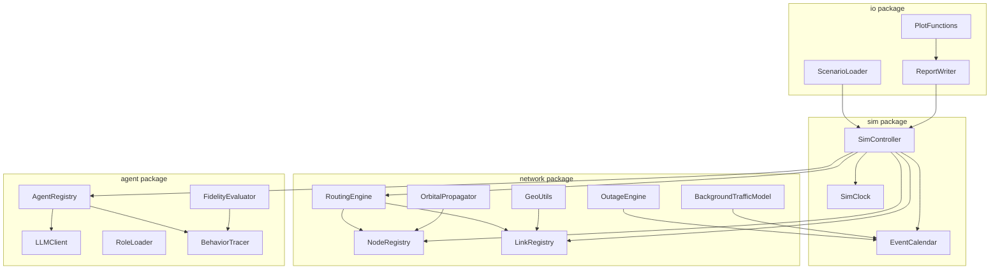
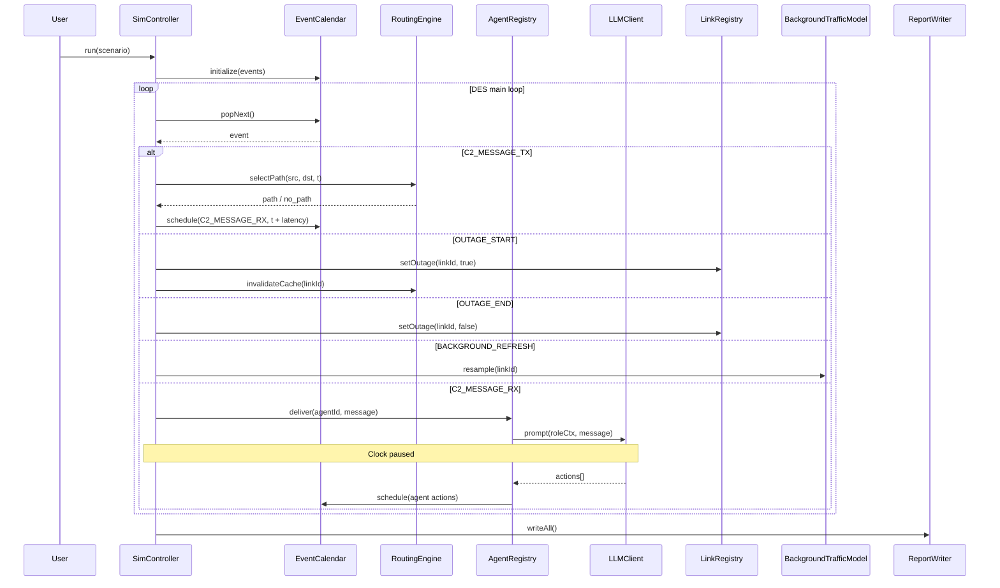
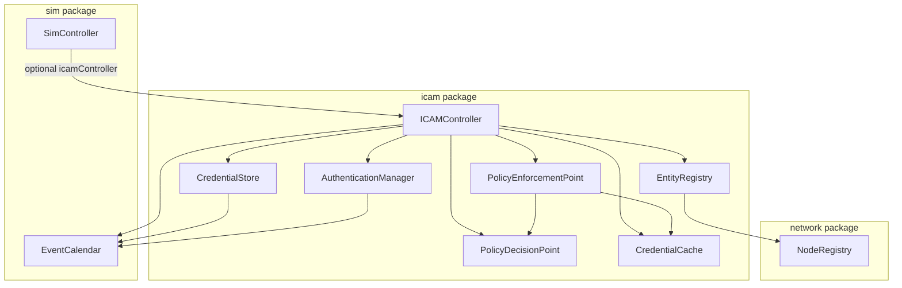
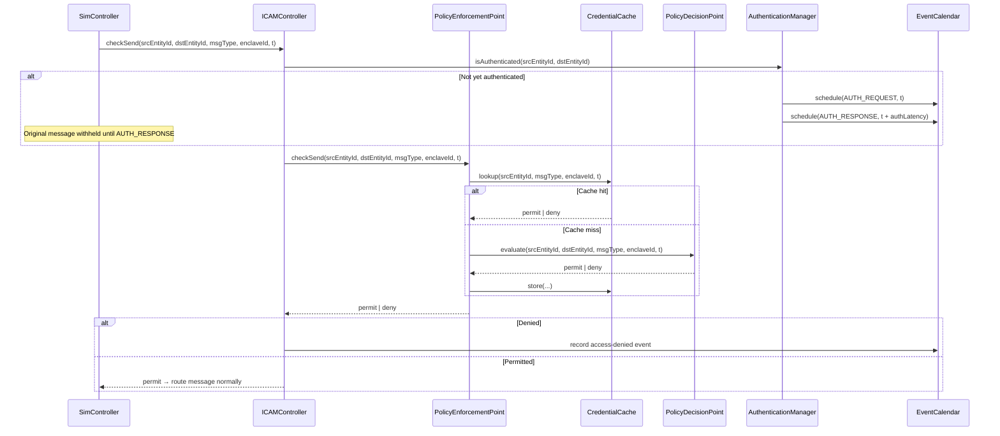

# Design Document: MATLAB Network Simulator

## Overview

The MATLAB Network Simulator is a discrete-event simulation (DES) application that models a heterogeneous global-scale communication network and, optionally, an agent-based human behavior emulation layer on top of it. The simulator is implemented entirely in MATLAB using object-oriented classes and runs as a standalone MATLAB application (no Simulink or SimEvents dependency).

The system has two major layers:

1. **Network Simulation Layer** — models nodes, links, outages, background traffic, C2 message routing, and statistics collection using a custom DES engine built around a min-heap event calendar.
2. **Agent Behavior Layer** — binds LLM-driven agents to network nodes, drives them through the simulation clock, and evaluates their behavior against reference specifications.

### Key Design Decisions

- **Pure MATLAB, no SimEvents**: The DES engine is implemented from scratch using a binary min-heap priority queue. This avoids a Simulink/SimEvents license dependency and keeps the codebase portable.
- **MATLAB `graph` object for routing**: MATLAB's built-in `graph` and `shortestpath` (Dijkstra, `'positive'` method) are used for path selection, giving O((V+E) log V) performance without external dependencies.
- **Vincenty's algorithm for geodesy**: WGS-84 geodesic distances are computed using Vincenty's iterative formula, which achieves sub-millimeter accuracy — well within the 0.1% requirement.
- **Keplerian two-body propagator for orbital mechanics**: Satellite positions are propagated using the classical two-body Keplerian model (`keplerian2ijk` from the Aerospace Toolbox, or a self-contained fallback). This is sufficient for the simulation's fidelity requirements.
- **OpenAI-compatible REST API for LLM calls**: Agents communicate with any OpenAI-compatible endpoint via MATLAB's `webwrite`/`webread`. The simulation clock pauses synchronously while awaiting each LLM response.
- **Struct-of-arrays for memory efficiency**: Node and link state is stored in struct-of-arrays rather than arrays of objects to keep memory usage within the 16 GB constraint for 1,000-node scenarios.

---

## Architecture

The simulator is organized into four top-level packages (MATLAB namespaces implemented as `+package` folders):

```
+sim/          — DES engine, event calendar, simulation controller
+network/      — node, link, routing, outage, background traffic models
+agent/        — LLM agent, role loader, behavior trace, fidelity evaluator
+io/           — scenario loader/saver, report writer, CSV exporter, plotting
```

### High-Level Component Diagram



### Simulation Execution Flow



---

## Components and Interfaces

### 2.1 `sim.EventCalendar`

A binary min-heap keyed on simulation time. All scheduled events are stored here.

```matlab
% Public interface
ec = sim.EventCalendar();
ec.schedule(event)          % insert event struct
event = ec.popNext()        % remove and return earliest event
tf = ec.isEmpty()           % logical
ec.reschedule(eventId, newTime)  % update time of pending event
```

**Event struct fields:**

| Field | Type | Description |
|---|---|---|
| `time` | double | Simulation time (seconds) |
| `type` | string | Event type enum (see below) |
| `id` | uint64 | Unique event identifier |
| `payload` | struct | Type-specific data |

**Event types:**

| Type | Payload fields |
|---|---|
| `C2_MESSAGE_TX` | `msgId`, `srcNodeId`, `dstNodeId`, `sizeBytes` |
| `C2_MESSAGE_RX` | `msgId`, `srcNodeId`, `dstNodeId`, `txTime`, `latencyMs` |
| `C2_MESSAGE_FAIL` | `msgId`, `srcNodeId`, `dstNodeId`, `reason` |
| `OUTAGE_START` | `linkId` |
| `OUTAGE_END` | `linkId` |
| `BACKGROUND_REFRESH` | `linkId` |
| `AGENT_IDLE_CHECK` | `agentId` |
| `SIM_END` | — |

### 2.2 `sim.SimController`

Owns the main DES loop and coordinates all subsystems.

```matlab
sc = sim.SimController(scenario);
sc.run()          % blocking; runs until SIM_END or time limit
sc.pause()        % sets pause flag; loop checks after each event
sc.resume()
sc.stop()
state = sc.inspect()   % returns snapshot of all node/link/queue state
```

The controller holds references to all subsystem objects and passes them into event handlers. It writes the event log incrementally to a pre-opened file handle to avoid memory accumulation for large runs.

### 2.3 `network.NodeRegistry`

Stores all node state in struct-of-arrays for memory efficiency.

```matlab
% Internal storage (struct-of-arrays)
nodes.id          % string array, N×1
nodes.type        % categorical: Stationary | Mobile
nodes.lat         % double, N×1 (degrees)
nodes.lon         % double, N×1 (degrees)
nodes.altM        % double, N×1 (meters)
nodes.trajectory  % cell array of trajectory structs (Mobile only)
nodes.keplerElems % struct array (satellite nodes only)
```

```matlab
nr = network.NodeRegistry(nodeStructArray);
pos = nr.getPosition(nodeId, simTimeSec)   % returns [lat, lon, altM]
nr.updatePositions(simTimeSec)             % batch-update all Mobile nodes
idx = nr.indexOf(nodeId)                   % integer index
```

### 2.4 `network.LinkRegistry`

Stores link state in struct-of-arrays.

```matlab
links.id              % string array
links.type            % categorical: GEO | LEO | Fiber | LOS
links.srcNodeId       % string array
links.dstNodeId       % string array
links.nominalLatencyMs % double
links.bandwidthBps    % double
links.outageRate      % double (events/sec)
links.outageDist      % struct: {type, params}
links.bgTrafficDist   % struct: {type, params}
links.isActive        % logical (not in outage, LOS coverage satisfied)
links.bgLoadFraction  % double (current background traffic fraction)
links.effectiveBwBps  % double (computed)
links.congestionPenaltyMs % double
```

```matlab
lr = network.LinkRegistry(linkStructArray);
lr.setOutage(linkId, tf)
lr.setLOSActive(linkId, tf)
lr.refreshBackground(linkId)
bw = lr.getEffectiveBandwidth(linkId)
lat = lr.getEffectiveLatency(linkId)   % nominal + congestion penalty
```

### 2.5 `network.RoutingEngine`

Wraps MATLAB's `graph` / `shortestpath` with an invalidation cache.

```matlab
re = network.RoutingEngine(nodeRegistry, linkRegistry);
[path, totalLatencyMs] = re.selectPath(srcId, dstId, simTimeSec)
re.invalidateCache(linkId)   % called on outage transitions
re.rebuildGraph()            % full rebuild from active links
```

**Design rationale**: The routing engine maintains a `digraph` object built from currently active links. Edge weights are `effectiveLatencyMs`. On each outage transition, only the affected edges are removed/added rather than rebuilding the full graph, keeping incremental updates O(degree) rather than O(E). A full rebuild is triggered on scenario load and after batch topology changes.

`shortestpath(G, src, dst, 'Method', 'positive')` implements Dijkstra and meets the 100 ms wall-clock requirement for 1,000 nodes / 10,000 links.

### 2.6 `network.OutageEngine`

Generates Poisson-distributed outage events and schedules them into the event calendar.

```matlab
oe = network.OutageEngine(linkRegistry, eventCalendar);
oe.scheduleNextOutage(linkId, currentTimeSec)
% Called internally when OUTAGE_END fires to schedule the next OUTAGE_START
```

Outage inter-arrival times are drawn from `exprnd(1/outageRate)`. Duration is sampled from the configured distribution:
- `exponential`: `exprnd(mean)`
- `lognormal`: `lognrnd(mu, sigma)`
- `fixed`: constant value

### 2.7 `network.BackgroundTrafficModel`

Samples background traffic load at each refresh interval.

```matlab
btm = network.BackgroundTrafficModel(linkRegistry, eventCalendar, refreshIntervalSec);
btm.resample(linkId)   % draw new load fraction, update linkRegistry
```

Supported distributions: `uniform` (`rand`), `normal` (`randn`, clamped to [0,1]), `lognormal` (`lognrnd`, clamped to [0,1]).

### 2.8 `network.GeoUtils`

Static utility functions for WGS-84 geodesy.

```matlab
distM = network.GeoUtils.vincenty(lat1, lon1, lat2, lon2)
% Vincenty's iterative formula on WGS-84 ellipsoid
% Accuracy: sub-millimeter (< 0.001% error)

tf = network.GeoUtils.isLOSVisible(mobileLat, mobileLon, mobileAltM, ...
                                    stationLat, stationLon, coverageRadiusM)
% Accounts for Earth curvature via WGS-84 ellipsoid model
```

### 2.9 `network.OrbitalPropagator`

Propagates satellite positions from Keplerian elements.

```matlab
[lat, lon, altM] = network.OrbitalPropagator.propagate(keplerElems, epochSec, simTimeSec)
```

**Keplerian elements struct:**

| Field | Description |
|---|---|
| `semiMajorAxisM` | Semi-major axis (meters) |
| `eccentricity` | Orbital eccentricity |
| `inclinationDeg` | Inclination (degrees) |
| `raanDeg` | Right ascension of ascending node (degrees) |
| `argPeriapsisDeg` | Argument of periapsis (degrees) |
| `trueAnomalyDeg` | True anomaly at epoch (degrees) |
| `epochSec` | Reference epoch (simulation seconds) |

The propagator solves Kepler's equation iteratively (Newton-Raphson, tolerance 1e-10 rad) to find eccentric anomaly, then converts to ECI Cartesian coordinates and finally to geodetic (WGS-84) latitude/longitude/altitude using the standard ECEF transformation.

### 2.10 `agent.LLMClient`

Wraps HTTP calls to an OpenAI-compatible chat completions endpoint.

```matlab
client = agent.LLMClient(config)
% config: struct with fields: baseUrl, apiKey, model, timeoutSec, maxTokens

response = client.complete(systemPrompt, userMessage)
% Synchronous blocking call via MATLAB webwrite/webread
% Returns struct: {content, finishReason, usageTokens}
```

The client constructs a JSON request body with `messages` array (system + user roles), sends it via `webwrite`, and parses the response. API key is read from the `config` struct (populated from environment variable `NETSIM_LLM_API_KEY` at startup, never logged).

### 2.11 `agent.AgentRegistry`

Manages all agents and their bindings to nodes.

```matlab
ar = agent.AgentRegistry(agentDefs, nodeRegistry, llmClient, eventCalendar);
ar.deliver(agentId, c2Message, simTimeSec)
% Calls LLM, records actions in BehaviorTracer, schedules resulting C2 messages
ar.checkIdle(agentId, simTimeSec)
% Fires idle-timeout action if no message received within idleTimeoutSec
```

### 2.12 `agent.RoleLoader`

Loads and validates Role_Definition Markdown files.

```matlab
role = agent.RoleLoader.load(filePath)
% Returns struct: {name, sourceRef, fullMarkdown}
% Validates: file exists, non-empty, role name extractable (first H1 heading)
```

### 2.13 `agent.BehaviorTracer`

Records Agent_Actions in time order.

```matlab
bt = agent.BehaviorTracer(agentId, role);
bt.record(simTimeSec, triggerEventId, actionType, targetAgentId, msgId)
trace = bt.getTrace()   % returns table with all recorded actions
bt.exportCSV(filePath)
```

### 2.14 `agent.FidelityEvaluator`

Compares a BehaviorTrace against a Reference_Behavior specification.

```matlab
fe = agent.FidelityEvaluator(referenceBehavior);
result = fe.evaluate(behaviorTrace, eventLog)
% result: struct with fidelityScore, missingActions, extraActions, deviations
% Network-constrained missing actions are annotated, not penalized
```

### 2.15 `io.ScenarioLoader`

Loads and validates JSON scenario files.

```matlab
scenario = io.ScenarioLoader.load(filePath)
% Validates JSON syntax, node defs, link defs, agent defs, orbital elements
% Throws descriptive errors with file path + field path on validation failure

io.ScenarioLoader.save(scenario, filePath)
```

### 2.16 `io.ReportWriter`

Writes all output files at simulation end.

```matlab
rw = io.ReportWriter(outputDir, scenarioName);
rw.writeEventLog(eventLog)          % CSV
rw.writeStatisticsReport(stats)     % JSON
rw.writeEvaluationReport(evalResult) % JSON
rw.writeBehaviorTraces(agentRegistry) % CSV per agent
```

### 2.17 `io.PlotFunctions`

Standalone MATLAB functions for visualization.

```matlab
io.PlotFunctions.latencyHistogram(statsReport)
% Plots histogram of delivered C2 message latencies

io.PlotFunctions.outageGantt(statsReport, linkIds)
% Plots per-link outage timelines as Gantt chart

io.PlotFunctions.fidelityBoxPlot(evalReports)
% Plots per-agent fidelity scores across multiple runs as box-and-whisker
```

---

## Data Models

### 4.1 Scenario File (JSON)

```json
{
  "scenarioName": "string",
  "simulationDurationSec": 3600,
  "nodes": [
    {
      "id": "string",
      "type": "Stationary | Mobile",
      "lat": 40.7128,
      "lon": -74.0060,
      "altM": 0.0,
      "trajectory": null,
      "keplerElements": null
    }
  ],
  "links": [
    {
      "id": "string",
      "type": "GEO_Satellite | LEO_Satellite | Fiber | Line_Of_Sight",
      "srcNodeId": "string",
      "dstNodeId": "string",
      "nominalLatencyMs": 270.0,
      "bandwidthBps": 1e9,
      "outageRate": 0.001,
      "outageDuration": { "distribution": "exponential", "meanSec": 60 },
      "backgroundTraffic": { "distribution": "uniform", "min": 0.1, "max": 0.4 },
      "coverageRadiusM": null
    }
  ],
  "c2Messages": [
    {
      "id": "string",
      "srcNodeId": "string",
      "dstNodeId": "string",
      "sizeBytes": 512,
      "scheduledTimeSec": 100.0
    }
  ],
  "agents": [
    {
      "id": "string",
      "nodeId": "string",
      "roleDefinitionFile": "path/to/role.md",
      "idleTimeoutSec": 300
    }
  ],
  "referenceBehaviorFile": "path/to/reference.json",
  "routingPolicy": null
}
```

**Trajectory struct** (for Mobile nodes):

```json
{
  "type": "waypoints",
  "waypoints": [
    { "timeSec": 0, "lat": 40.0, "lon": -74.0, "altM": 10000 },
    { "timeSec": 3600, "lat": 51.5, "lon": -0.1, "altM": 10000 }
  ]
}
```

Position between waypoints is linearly interpolated in geodetic coordinates.

**Keplerian elements** (for satellite nodes):

```json
{
  "semiMajorAxisM": 6778000,
  "eccentricity": 0.001,
  "inclinationDeg": 53.0,
  "raanDeg": 120.0,
  "argPeriapsisDeg": 0.0,
  "trueAnomalyDeg": 45.0,
  "epochSec": 0.0
}
```

### 4.2 Event Log (CSV)

```
eventId,simTimeSec,eventType,linkId,msgId,srcNodeId,dstNodeId,latencyMs,reason
```

### 4.3 Statistics Report (JSON)

```json
{
  "scenarioName": "string",
  "simStartTimeSec": 0,
  "simEndTimeSec": 3600,
  "wallClockDurationSec": 12.4,
  "c2Messages": {
    "scheduled": 10000,
    "delivered": 9850,
    "failed": 150
  },
  "latency": {
    "meanMs": 312.4,
    "medianMs": 290.1,
    "p95Ms": 620.0
  },
  "perLink": [
    {
      "linkId": "string",
      "meanEffectiveBwBps": 8.5e8,
      "meanBgLoadFraction": 0.15,
      "totalC2MessagesRouted": 4200,
      "totalOutageDurationSec": 180.0,
      "outageFraction": 0.05
    }
  ],
  "agentFidelity": {
    "mean": 0.87,
    "min": 0.72,
    "max": 0.95
  }
}
```

### 4.4 Evaluation Report (JSON)

```json
{
  "runId": "uuid-string",
  "timestamp": "ISO-8601",
  "scenarioName": "string",
  "agents": [
    {
      "agentId": "string",
      "role": "string",
      "fidelityScore": 0.87,
      "missingActions": [
        { "actionType": "string", "expectedTimeSec": 120.0, "reason": "network-constrained | agent-failure" }
      ],
      "extraActions": [
        { "actionType": "string", "observedTimeSec": 135.0 }
      ],
      "deviations": [
        { "actionType": "string", "expectedTimeSec": 120.0, "observedTimeSec": 145.0, "deviationSec": 25.0 }
      ]
    }
  ]
}
```

### 4.5 Reference Behavior File (JSON)

```json
{
  "scenarioName": "string",
  "roles": [
    {
      "role": "Aircrew",
      "ordering": "strict | unordered",
      "actions": [
        { "actionType": "string", "triggerEvent": "string", "expectedTimeSec": 120.0 }
      ]
    }
  ]
}
```

### 4.6 Behavior Trace (CSV)

```
simTimeSec,agentId,role,actionType,targetAgentId,msgId
```

---

## Correctness Properties

*A property is a characteristic or behavior that should hold true across all valid executions of a system — essentially, a formal statement about what the system should do. Properties serve as the bridge between human-readable specifications and machine-verifiable correctness guarantees.*

### Property 1: Scenario Round-Trip Fidelity

*For any* valid scenario struct, serializing it to JSON via `ScenarioLoader.save` and then deserializing it via `ScenarioLoader.load` SHALL produce a scenario struct that is field-for-field equivalent to the original, including all node definitions, link definitions, agent assignments, and traffic parameters.

**Validates: Requirements 7.5**

### Property 2: Reference Behavior Round-Trip Fidelity

*For any* valid reference behavior specification, saving it to JSON and then loading it SHALL produce a specification that is field-for-field equivalent to the original, including all role entries, ordering constraints, and expected action sequences.

**Validates: Requirements 14.5**

### Property 3: Evaluation Report Consistency

*For any* valid Evaluation Report JSON file produced by the simulator, loading the file and re-computing the per-agent fidelity summary statistics (mean, min, max Fidelity_Score across all agents) SHALL produce values identical to those recorded in the file's `agentFidelity` summary block.

**Validates: Requirements 16.4**

### Property 4: Fidelity Score Correctness

*For any* agent behavior trace and reference behavior specification, the computed Fidelity_Score SHALL be a value in the closed interval [0.0, 1.0], and SHALL equal the fraction of required Reference_Behavior actions that appear in the Behavior_Trace (accounting for strict ordering constraints where configured). The score SHALL be consistent with the counts of matched, missing, and extra actions reported in the Evaluation_Report.

**Validates: Requirements 15.1, 15.2, 15.3**

### Property 5: Network-Constrained Annotation Does Not Penalize Fidelity

*For any* simulation run where a network outage or congestion event prevents delivery of a C2_Message that would have triggered a Reference_Behavior action, the Fidelity_Score for the affected agent SHALL be identical to the score computed when that action is excluded from the reference set entirely, and the missing action SHALL be annotated with reason `"network-constrained"` in the Evaluation_Report.

**Validates: Requirements 15.4**

### Property 6: Routing Selects Minimum Latency Active Path

*For any* network topology with at least two active paths between a source and destination node, the routing engine SHALL select the path whose total effective latency (sum of nominal link latencies plus congestion penalties) is less than or equal to the total effective latency of every other available active path.

**Validates: Requirements 5.2, 6.2**

### Property 7: Routing Excludes Outage Links

*For any* network topology with any combination of links in outage state, the routing engine SHALL never include a link that is currently in outage state in a selected path, regardless of whether that link would otherwise offer lower latency.

**Validates: Requirements 6.1**

### Property 8: Messages Fail on Unavailable Paths

*For any* C2_Message scheduled when no active path exists between its source and destination nodes, the simulator SHALL record a `C2_MESSAGE_FAIL` event in the Event_Log with reason `"no available path"`, and no `C2_MESSAGE_RX` event SHALL be recorded for that message.

**Validates: Requirements 4.4, 5.5**

### Property 9: GEO Satellite Latency Floor

*For any* link of type `GEO_Satellite`, the nominal one-way latency value stored in the link registry SHALL be no less than 270 ms, and the effective latency used for routing and message delivery computation SHALL be no less than 270 ms.

**Validates: Requirements 2.2**

### Property 10: Fiber Link Latency from Geographic Distance

*For any* pair of nodes connected by a `Fiber` link, the computed nominal latency SHALL equal the WGS-84 geodesic distance between the two nodes divided by the propagation speed of 200,000 km/s, within floating-point precision.

**Validates: Requirements 2.4**

### Property 11: Effective Bandwidth Formula and Congestion

*For any* link with total bandwidth B and background traffic load fraction f in [0, 1], the effective bandwidth SHALL equal B × (1 − f). When f ≥ 1.0, effective bandwidth SHALL be zero and the link SHALL be marked as congested, applying the configured congestion latency penalty to all C2_Messages traversing it.

**Validates: Requirements 3.2, 3.3**

### Property 12: WGS-84 Distance Accuracy

*For any* pair of geographic positions on the WGS-84 ellipsoid, the distance computed by `GeoUtils.vincenty` SHALL differ from the reference geodesic distance by no more than 0.1%, including near-antipodal point pairs and positions at extreme latitudes.

**Validates: Requirements 10.1**

### Property 13: LOS Visibility Accounts for Earth Curvature

*For any* mobile node position and stationary node position where the straight-line distance between them exceeds the geometric horizon distance computed from the WGS-84 ellipsoid, `GeoUtils.isLOSVisible` SHALL return false, and the corresponding LOS link SHALL be marked inactive.

**Validates: Requirements 2.5, 10.2**

### Property 14: Orbital Period Round-Trip

*For any* satellite node with a valid circular Keplerian orbit (eccentricity = 0), propagating the orbital position forward by exactly one orbital period T = 2π√(a³/μ) SHALL return a position within 1 meter of the initial position, where a is the semi-major axis and μ is Earth's gravitational parameter.

**Validates: Requirements 10.3**

### Property 15: Agent Message Delivery Timing

*For any* C2_Message sent by an agent with a known transmission time and computed path latency, the receiving agent SHALL be notified of the message at simulation time equal to the transmission time plus the total path latency, not at the transmission time.

**Validates: Requirements 12.4**

### Property 16: Behavior Trace Completeness

*For any* agent action recorded during a simulation run, the Behavior_Trace SHALL contain an entry with all required fields (simulation timestamp, agent identifier, role, action type, target agent identifier, message identifier), and the CSV export of the trace SHALL contain all required columns with no missing values for mandatory fields.

**Validates: Requirements 13.3, 16.2**

### Property 17: Event Time Ordering

*For any* simulation run, the sequence of events processed by the DES engine SHALL be non-decreasing in simulation time, and all Agent_Actions recorded in Behavior_Traces SHALL have timestamps that are consistent with (greater than or equal to) the timestamps of their triggering network events in the Event_Log.

**Validates: Requirements 13.5**

### Property 18: Batch Evaluation Report Run Uniqueness

*For any* batch of two or more Mission_Scenario runs, the combined Evaluation_Report SHALL contain one entry per run, each with a distinct run identifier and a distinct ISO-8601 timestamp, and the union of per-run fidelity scores SHALL match the individual run reports.

**Validates: Requirements 16.5**

### Property 19: Statistics Report Completeness

*For any* completed simulation run, the generated Statistics_Report SHALL contain all required top-level fields (scenario name, sim start/end times, wall-clock duration, C2 message counts, latency statistics) and a per-link entry for every link in the scenario, each containing mean effective bandwidth, mean background load, total C2 messages routed, and total outage duration.

**Validates: Requirements 9.1, 9.2**

---

## Error Handling

All validation errors are raised as MATLAB exceptions using `error(identifier, message, ...)` with structured identifiers of the form `netsim:component:errorType`. The simulator never silently swallows errors during scenario loading.

| Condition | Identifier | Behavior |
|---|---|---|
| Missing/malformed Mobile_Node trajectory | `netsim:node:malformedTrajectory` | Report node ID + field, halt loading |
| Link references non-existent node | `netsim:link:unknownNode` | Report link ID + node ID, halt loading |
| Invalid background traffic distribution params | `netsim:link:invalidBgParams` | Report link ID + param name, halt loading |
| JSON syntax error in scenario file | `netsim:io:jsonSyntaxError` | Report file path + approximate location, halt loading |
| Missing/invalid orbital elements | `netsim:node:invalidKeplerElements` | Report node ID + field, halt loading |
| Role definition file unreadable or empty | `netsim:agent:roleLoadError` | Report file path, halt loading |
| Agent assigned to non-existent node | `netsim:agent:unknownNode` | Report agent ID + node ID, halt loading |
| Reference behavior references unassigned role | `netsim:agent:unassignedRole` | Log warning, continue loading |
| LLM API call failure | `netsim:agent:llmError` | Log warning with HTTP status, record agent action as `LLM_FAILURE`, continue simulation |
| No path available for C2 message | — | Record `C2_MESSAGE_FAIL` event with reason `"no available path"`, continue |

---

## Testing Strategy

### Unit Tests

Unit tests cover individual component logic with specific examples and edge cases. They are organized under a `tests/` directory mirroring the package structure. Unit tests focus on concrete examples and edge conditions; property-based tests handle broad input coverage.

Key unit test areas:
- `GeoUtils.vincenty`: known geodesic distances (equatorial, polar, antipodal near-miss, same point)
- `OrbitalPropagator.propagate`: known circular orbit positions at quarter-period intervals; GEO altitude check
- `OutageEngine`: verify Poisson inter-arrival statistics over many samples; all three duration distributions
- `BackgroundTrafficModel`: verify distribution sampling stays within [0,1]; congestion threshold behavior
- `RoutingEngine.selectPath`: small hand-crafted topologies with known shortest paths; cache invalidation on outage transition
- `FidelityEvaluator.evaluate`: strict-ordered and unordered reference behavior cases; network-constrained annotation
- `ScenarioLoader.load` / `save`: round-trip on representative scenario files; JSON syntax error reporting
- `RoleLoader.load`: valid Markdown file; empty file; file without H1 heading
- `io.ReportWriter`: verify JSON output matches expected schema; CSV column headers

### Property-Based Tests

Property-based tests use the [matlab-prop-test](https://github.com/matlab-deep-learning/matlab-prop-test) library (or equivalent) with a minimum of 100 iterations per property. Each test is tagged with a comment referencing the design property it validates.

**Feature: matlab-network-sim**

| Property | Test description | Generator |
|---|---|---|
| Property 1 | Scenario round-trip | Random scenario structs with varying node/link counts (1–50 nodes, 0–200 links) |
| Property 2 | Reference behavior round-trip | Random reference behavior specs with 1–10 roles, strict and unordered ordering |
| Property 3 | Evaluation report consistency | Random evaluation results with 1–20 agents and random fidelity scores |
| Property 4 | Fidelity score correctness | Random trace/reference pairs with known overlap fractions |
| Property 5 | Network-constrained annotation | Random scenarios with injected network failures on specific message paths |
| Property 6 | Routing selects minimum latency | Random topologies with 2–20 nodes, 2+ active paths between source/destination |
| Property 7 | Routing excludes outage links | Random topologies with random subsets of links in outage state |
| Property 8 | Messages fail on unavailable paths | Random topologies with all paths blocked (all links in outage) |
| Property 9 | GEO latency floor | Random GEO link configurations with varying latency values |
| Property 10 | Fiber latency from distance | Random node pairs with fiber links, verify latency = distance / 200000 km/s |
| Property 11 | Effective bandwidth formula | Random bandwidth and load fraction pairs in [0, 2] |
| Property 12 | WGS-84 distance accuracy | Random lat/lon pairs including edge cases (poles, equator, antipodal) |
| Property 13 | LOS visibility and Earth curvature | Random positions beyond geometric horizon, verify LOS returns false |
| Property 14 | Orbital period round-trip | Random circular orbit parameters (varying altitude, inclination, RAAN) |
| Property 15 | Agent message delivery timing | Random messages with known latencies, verify delivery time = tx_time + latency |
| Property 16 | Behavior trace completeness | Random agent action sequences, verify all required fields present in trace and CSV |
| Property 17 | Event time ordering | Random simulation runs, verify event log and behavior trace timestamps non-decreasing |
| Property 18 | Batch evaluation report uniqueness | Random sets of 2–10 evaluation reports, verify unique run IDs and timestamps |
| Property 19 | Statistics report completeness | Random simulation results, verify all required fields present in statistics report |

Tag format for each test: `% Feature: matlab-network-sim, Property N: <property_text>`

### Integration Tests

Integration tests exercise the full simulation pipeline on small scenarios:
- A 5-node, 6-link scenario with one GEO satellite link, one fiber link, and one LOS link
- Verify event log CSV is written and parseable
- Verify statistics report JSON matches expected schema and all required fields are present
- Verify LLM agent integration (using a mock HTTP server returning canned responses) produces behavior traces
- Verify fidelity evaluation produces a score in [0,1] and an evaluation report with all required fields
- Verify LOS link transitions to outage when mobile node moves outside coverage radius
- Verify batch run produces combined evaluation report with unique run identifiers

### Performance Tests

- 1,000-node, 10,000-link scenario: verify routing completes within 100 ms wall-clock per message (Requirement 6.4)
- 100,000 C2 messages scheduled: verify simulation completes without memory errors on a 16 GB system (Requirement 5.6)
- Measure memory footprint of NodeRegistry and LinkRegistry at maximum scale (Requirement 1.3)

### Smoke Tests

- Plotting functions (`latencyHistogram`, `outageGantt`, `fidelityBoxPlot`): call with sample data, verify no MATLAB error (Requirements 9.4, 9.5, 15.5)
- Simulation start/pause/resume/stop API: verify state transitions work correctly (Requirement 8.2)


---

## ICAM Layer Design

### Overview

The Identity, Credential, and Access Management (ICAM) layer adds a fifth package — `+icam/` — to the simulator. It models authentication exchanges, certificate lifecycle, policy decision points, credential caching, and access control enforcement as first-class discrete-event participants. All ICAM traffic (authentication handshakes, PDP queries, certificate renewals, policy synchronization) is modeled as C2_Messages routed through the existing network simulation, making ICAM latency and failure modes subject to the same outage and congestion constraints as operational traffic.

The ICAM layer integrates with `SimController` via an optional `icamController` property. When present, `SimController` consults the `ICAMController` before routing any `C2_MESSAGE_TX` event, and the `ICAMController` injects ICAM-related events (AUTH_REQUEST, AUTH_RESPONSE, CERT_RENEWAL_REQUEST, POLICY_SYNC, etc.) into the `EventCalendar` using the same scheduling interface as all other subsystems.

### Architecture



### ICAM Event Flow



---

## ICAM Components and Interfaces

### 5.1 `icam.EntityRegistry`

Manages all entities and sub-entities using struct-of-arrays storage for memory efficiency, consistent with the existing `NodeRegistry` and `LinkRegistry` design.

```matlab
% Internal storage (struct-of-arrays)
entities.entityId       % string array, N×1
entities.nodeId         % string array, N×1
entities.entityType     % categorical: human | NPE
entities.parentEntityId % string array, N×1 (empty string for top-level entities)
entities.enclaveIds     % cell array of string arrays, N×1

er = icam.EntityRegistry(entityDefs, nodeRegistry);
% Validates all nodeIds against nodeRegistry on construction
% Throws netsim:icam:unknownNode if any nodeId is not in NodeRegistry

er.addEntity(def)                    % add a single entity definition
entity = er.getEntity(entityId)      % returns entity struct
subEntities = er.getSubEntities(nodeId)  % returns array of entity structs hosted at nodeId
idx = er.indexOf(entityId)           % integer index into struct-of-arrays
n = er.count()                       % total number of entities
```

**Design rationale**: Struct-of-arrays storage allows 10,000+ entities to be held in contiguous memory arrays, avoiding per-object overhead. The `enclaveIds` field is a cell array because each entity may belong to a variable number of enclaves.

### 5.2 `icam.CredentialStore`

Manages certificates and their lifecycle per entity. Certificate renewal triggers `CERT_RENEWAL_REQUEST` events into the `EventCalendar`, which are then routed as C2_Messages to the Trust_Anchor node.

```matlab
% Certificate struct schema
% cert.issuer          string  — Trust_Anchor entity identifier
% cert.subjectId       string  — subject Entity identifier
% cert.publicKey       string  — synthetic public key value (hex string)
% cert.roleBindings    struct array — {enclaveId, roleName}
% cert.issuedTimeSec   double  — simulation time of issuance
% cert.expirySec       double  — simulation time of expiry
% cert.isExpired       logical — set true when expiry is detected

cs = icam.CredentialStore();

cs.issueCertificate(entityId, trustAnchorId, roleBindings, validityPeriodSec, simTimeSec)
% Creates and stores a Certificate struct; computes expirySec = simTimeSec + validityPeriodSec

cert = cs.getCertificate(entityId)
% Returns the current Certificate struct for entityId; throws netsim:icam:noCertificate if none

expiredIds = cs.checkExpiry(simTimeSec)
% Returns cell array of entityIds whose expirySec <= simTimeSec and isExpired is false
% Marks matching certificates as expired and schedules CERT_RENEWAL_REQUEST events

cs.revoke(entityId)
% Marks the certificate as expired immediately; schedules CERT_RENEWAL_REQUEST
```

### 5.3 `icam.AuthenticationManager`

Tracks authentication state between entity pairs. Uses `containers.Map` keyed on a canonical pair string (`entityIdA + '|' + entityIdB`, sorted lexicographically so the key is order-independent).

```matlab
am = icam.AuthenticationManager();

tf = am.isAuthenticated(entityIdA, entityIdB)
% Returns true if the pair has a recorded successful authentication

am.initiateExchange(entityIdA, entityIdB, simTimeSec, eventCalendar)
% Schedules AUTH_REQUEST event at simTimeSec
% Schedules AUTH_RESPONSE event at simTimeSec + authRequestLatency (derived from network path)
% Schedules AUTH_TIMEOUT event at simTimeSec + retryLimitSec

am.recordSuccess(entityIdA, entityIdB, simTimeSec)
% Records the pair as authenticated at simTimeSec; cancels pending AUTH_TIMEOUT

am.recordFailure(entityIdA, entityIdB, reason)
% Records failure; increments retry counter; re-schedules AUTH_REQUEST if retries remain
```

**New event types added to EventCalendar:**

| Type | Payload fields |
|---|---|
| `AUTH_REQUEST` | `srcEntityId`, `dstEntityId`, `exchangeId` |
| `AUTH_RESPONSE` | `srcEntityId`, `dstEntityId`, `exchangeId`, `success` |
| `AUTH_TIMEOUT` | `srcEntityId`, `dstEntityId`, `exchangeId` |

### 5.4 `icam.PolicyDecisionPoint`

Evaluates access control queries against a loaded policy definition. The policy is loaded from a JSON file at scenario initialization time.

```matlab
pdp = icam.PolicyDecisionPoint(policyFilePath);
% Loads and validates policy JSON on construction

result = pdp.evaluate(requestingEntityId, targetEntityId, messageType, enclaveId, simTimeSec)
% Returns struct: {decision ('permit'|'deny'), reason (string)}
% Applies rules in order; first matching rule wins
% Falls back to failPolicy ('open'|'closed') if no rule matches or PDP is unreachable
```

**Policy rule struct:**

| Field | Type | Description |
|---|---|---|
| `enclave` | string | Enclave identifier this rule applies to |
| `role` | string | Role name that must be held in the enclave |
| `messageType` | string | C2 message type pattern (supports `*` wildcard) |
| `decision` | string | `'permit'` or `'deny'` |

**Fail policy behavior**: When the PDP node is unreachable (detected by `ICAMController` via the network routing engine), `evaluate` is called with a `pdpUnreachable` flag. The PDP returns `permit` for fail-open or `deny` for fail-closed, and records a `pdp-unreachable` event in the Event_Log.

### 5.5 `icam.CredentialCache`

Per-entity cache of PDP decisions, keyed on a composite cache key.

```matlab
% Cache key: entityId + '|' + resourceType + '|' + enclaveId
% Cache entry: struct {decision, timestamp, ttl}

cc = icam.CredentialCache(ttlConfigMap);
% ttlConfigMap: containers.Map of enclaveId → ttlSec (0 = caching disabled)

result = cc.lookup(entityId, resourceType, enclaveId, simTimeSec)
% Returns 'permit', 'deny', or '' (cache miss)
% Returns '' if TTL is 0 for the enclave (caching disabled)
% Returns '' if entry age > TTL

cc.store(entityId, resourceType, enclaveId, decision, simTimeSec)
% Stores decision with timestamp; no-op if TTL is 0 for the enclave

cc.invalidateEnclave(enclaveId)
% Removes all cache entries for the specified enclave across all entities

stats = cc.getStats()
% Returns struct: {hits, misses, invalidations}
```

### 5.6 `icam.PolicyEnforcementPoint`

Intercepts message send and receive operations and enforces access control decisions. Uses `CredentialCache` first; falls back to `PolicyDecisionPoint` on a cache miss, which generates a C2_Message query.

```matlab
pep = icam.PolicyEnforcementPoint(credentialCache, policyDecisionPoint, eventLog);

result = pep.checkSend(srcEntityId, dstEntityId, messageType, enclaveId, simTimeSec)
% Returns struct: {decision ('permit'|'deny'), reason, cacheHit (logical)}
% On deny: records access-denied event in EventLog

result = pep.checkReceive(dstEntityId, messageType, enclaveId, simTimeSec)
% Returns struct: {decision ('permit'|'deny'), reason, cacheHit (logical)}
% On deny: records access-denied event in EventLog
```

**Design rationale**: Separating `checkSend` and `checkReceive` allows the simulator to enforce both send-side and receive-side access control independently, matching the requirement that receiving entities must also hold appropriate role bindings (Requirement 21.4).

### 5.7 `icam.ICAMController`

Top-level coordinator for the ICAM layer. Wired into `SimController` as an optional property. Holds references to all ICAM subsystems and dispatches ICAM-related events from the `EventCalendar`.

```matlab
ic = icam.ICAMController();

ic.initialize(scenario, nodeRegistry, eventCalendar)
% Constructs EntityRegistry, CredentialStore, AuthenticationManager,
% PolicyDecisionPoint, CredentialCache, PolicyEnforcementPoint
% Issues initial certificates for all entities
% Schedules initial CERT_RENEWAL_REQUEST events for entities with pre-configured expiry times

result = ic.checkSend(srcEntityId, dstEntityId, messageType, enclaveId, simTimeSec)
% Called by SimController before routing any C2_MESSAGE_TX
% Returns 'permit' or 'deny'
% Initiates auth exchange if entities are not yet authenticated

ic.handleAuthRequest(event)
ic.handleAuthResponse(event)
ic.handleAuthTimeout(event)
ic.handleCertRenewal(event)
% Event handlers dispatched by SimController's DES loop

ic.checkExpiredCredentials(simTimeSec)
% Called at each simulation time step; delegates to CredentialStore.checkExpiry

report = ic.buildICAMReport()
% Returns statistics struct (see Data Models section)
```

**Integration with SimController**: `SimController` gains an optional `icamController` property (default: `[]`). The DES loop is modified as follows:

```matlab
% In SimController event dispatch (C2_MESSAGE_TX handler):
if ~isempty(sc.icamController)
    decision = sc.icamController.checkSend(srcEntityId, dstEntityId, msgType, enclaveId, t);
    if strcmp(decision, 'deny')
        sc.eventLog.record(t, 'ACCESS_DENIED', srcEntityId, dstEntityId, msgType);
        return;  % message discarded; no C2_MESSAGE_RX scheduled
    end
end
% ... existing routing logic ...
```

New event types added to `EventCalendar` for ICAM:

| Type | Payload fields |
|---|---|
| `AUTH_REQUEST` | `srcEntityId`, `dstEntityId`, `exchangeId` |
| `AUTH_RESPONSE` | `srcEntityId`, `dstEntityId`, `exchangeId`, `success` |
| `AUTH_TIMEOUT` | `srcEntityId`, `dstEntityId`, `exchangeId` |
| `CERT_RENEWAL_REQUEST` | `entityId`, `trustAnchorId` |
| `CERT_RENEWAL_RESPONSE` | `entityId`, `trustAnchorId`, `success` |
| `POLICY_SYNC` | `srcPdpNodeId`, `dstPdpNodeId` |

---

## ICAM Data Models

### 6.1 Entity Definition in Scenario JSON

Entities are defined in a new top-level `"entities"` array in the Scenario JSON file:

```json
{
  "entities": [
    {
      "entityId": "string",
      "nodeId": "string",
      "type": "human | NPE",
      "parentEntityId": null,
      "enclaveIds": ["enclave-alpha", "enclave-bravo"],
      "roleBindings": [
        { "enclaveId": "enclave-alpha", "roleName": "pilot" },
        { "enclaveId": "enclave-bravo", "roleName": "mission-commander" }
      ],
      "certificate": {
        "trustAnchorId": "string",
        "validityPeriodSec": 3600
      }
    }
  ]
}
```

### 6.2 Certificate Struct Schema

```json
{
  "issuer": "trust-anchor-node-id",
  "subjectId": "entity-id",
  "publicKey": "hex-string",
  "roleBindings": [
    { "enclaveId": "string", "roleName": "string" }
  ],
  "issuedTimeSec": 0.0,
  "expirySec": 3600.0,
  "isExpired": false
}
```

### 6.3 Policy Definition JSON Schema

```json
{
  "enclaves": [
    {
      "enclaveId": "string",
      "cacheTtlSec": 300,
      "failPolicy": "open | closed"
    }
  ],
  "trustAnchors": [
    {
      "trustAnchorId": "string",
      "nodeId": "string",
      "certificateValidityPeriodSec": 3600
    }
  ],
  "rules": [
    {
      "enclave": "string",
      "role": "string",
      "messageType": "string",
      "decision": "permit | deny"
    }
  ]
}
```

### 6.4 ICAM Statistics in Statistics_Report

The `Statistics_Report` JSON is extended with a new `"icam"` block:

```json
{
  "icam": {
    "authExchanges": {
      "total": 1200,
      "successful": 1180,
      "failed": 15,
      "timedOut": 5
    },
    "cacheHitRate": 0.87,
    "accessDeniedCount": {
      "total": 42,
      "perEntity": { "entity-id": 3 },
      "perEnclave": { "enclave-alpha": 28, "enclave-bravo": 14 }
    },
    "certRenewals": {
      "total": 88,
      "successful": 85,
      "failed": 3
    },
    "pdpStats": [
      {
        "pdpNodeId": "string",
        "totalQueries": 5000,
        "permitDecisions": 4800,
        "denyDecisions": 200,
        "meanQueryLatencyMs": 45.2
      }
    ],
    "entityCounts": {
      "human": 12,
      "npe": 88
    },
    "perEnclaveRoleBindingCounts": {
      "enclave-alpha": 45,
      "enclave-bravo": 30
    }
  }
}
```

### 6.5 Error Handling (ICAM)

ICAM validation errors follow the same `netsim:component:errorType` convention as the rest of the simulator:

| Condition | Identifier | Behavior |
|---|---|---|
| Entity references non-existent node | `netsim:icam:unknownNode` | Report entity ID + node ID, halt loading |
| Duplicate entity identifier | `netsim:icam:duplicateEntityId` | Report entity ID, halt loading |
| Role_Binding references undefined enclave | `netsim:icam:unknownEnclave` | Report entity ID + enclave ID, halt loading |
| Role_Binding references undefined role name | `netsim:icam:unknownRole` | Report entity ID + role name, halt loading |
| NPE assigned human-restricted role binding | `netsim:icam:policyViolation` | Record policy-violation event, deny assignment, continue |
| Certificate not found for entity | `netsim:icam:noCertificate` | Report entity ID, halt if required for auth |
| Policy definition JSON syntax error | `netsim:icam:policyJsonError` | Report file path, halt loading |
| Trust_Anchor node unreachable at renewal | — | Record credential-renewal-failure event, retain expired cert, continue |
| PDP node unreachable at query time | — | Apply fail-open/fail-closed policy, record pdp-unreachable event, continue |

---

## ICAM Correctness Properties

### Property 20: Authentication Exchange Completeness

*For any* pair of entities that have not previously communicated within a scenario run, the first message transmission attempt between them SHALL result in exactly one AUTH_REQUEST event and exactly one AUTH_RESPONSE event being scheduled in the EventCalendar before the original message is delivered, regardless of the message content or type.

**Validates: Requirements 19.1, 19.3**

### Property 21: Credential Cache Consistency

*For any* sequence of access control queries with identical inputs (requesting entity, target entity, message type, enclave), the sequence of permit/deny decisions returned SHALL be identical whether the CredentialCache is enabled or disabled, provided no policy changes occur between queries.

**Validates: Requirements 23.7**

### Property 22: Certificate Expiry Detection

*For any* set of certificates with configured expiry times, every certificate whose expiry simulation time is less than or equal to the current simulation time SHALL be detected and marked as expired by `CredentialStore.checkExpiry`, and a CERT_RENEWAL_REQUEST event SHALL be scheduled for each such certificate, within the same simulation time step as the expiry.

**Validates: Requirements 18.3**

### Property 23: Access-Denied Does Not Penalize Fidelity

*For any* simulation run where an access-denied decision blocks an Agent_Action that appears in the Reference_Behavior, the Fidelity_Score for the affected agent SHALL be identical to the score computed when that action is excluded from the reference set entirely, and the missing action SHALL be annotated with reason `"access-denied"` in the Evaluation_Report.

**Validates: Requirements 21.6**

### Property 24: PDP Unreachable Fail Policy

*For any* scenario configuration where the Policy_Decision_Point node is unreachable (all paths in outage state), every access control decision returned by the PolicyEnforcementPoint SHALL match the configured fail policy: all decisions SHALL be `'permit'` when fail-open is configured, and all decisions SHALL be `'deny'` when fail-closed is configured.

**Validates: Requirements 20.5**

### Property 25: Multi-Enclave Role Independence

*For any* entity holding role bindings in two or more enclaves, a change to the entity's role binding in one enclave (including invalidation of its CredentialCache entries for that enclave) SHALL have no effect on the entity's role bindings or CredentialCache entries in any other enclave.

**Validates: Requirements 22.2, 22.3, 22.4**

### Property 26: NPE Identity Equivalence

*For any* Non_Person_Entity and any human entity with equivalent identity configurations (same enclave memberships, same role bindings, same certificate validity period), the sequence of ICAM events generated (authentication exchanges, certificate renewals, PDP queries, access control decisions) SHALL be structurally identical, differing only in the entity identifier and entity type field.

**Validates: Requirements 24.1, 24.3**

---

## ICAM Testing Strategy

### Unit Tests

Key unit test areas for the ICAM layer:

- `icam.EntityRegistry`: construction with valid/invalid node references; `getSubEntities` returns all entities for a node; `indexOf` returns correct index; duplicate entity ID detection
- `icam.CredentialStore`: `issueCertificate` computes correct expiry time; `checkExpiry` returns all and only expired entities; `revoke` marks certificate expired immediately
- `icam.AuthenticationManager`: `isAuthenticated` returns false before exchange, true after `recordSuccess`; `initiateExchange` schedules correct event types; `recordFailure` increments retry counter
- `icam.PolicyDecisionPoint`: permit/deny decisions for matching rules; first-matching-rule semantics; wildcard message type matching; fail-open and fail-closed behavior
- `icam.CredentialCache`: cache hit within TTL; cache miss after TTL expiry; TTL=0 always misses; `invalidateEnclave` removes only entries for the specified enclave; `getStats` returns correct counts
- `icam.PolicyEnforcementPoint`: cache hit path does not call PDP; cache miss path calls PDP and stores result; deny path records access-denied event
- `icam.ICAMController`: `initialize` issues certificates for all entities; `checkSend` returns deny when PEP denies; `buildICAMReport` contains all required fields

### Property-Based Tests

Property-based tests for the ICAM layer use the same library and configuration as the existing property tests (minimum 100 iterations per property, tagged with feature and property number).

**Feature: matlab-network-sim**

| Property | Test description | Generator |
|---|---|---|
| Property 20 | Authentication exchange completeness | Random entity pairs with no prior auth state; random message types |
| Property 21 | Credential cache consistency | Random policy rules and query sequences; cache enabled vs. disabled |
| Property 22 | Certificate expiry detection | Random certificate sets with varying expiry times; random simulation time advances |
| Property 23 | Access-denied does not penalize fidelity | Random scenarios with access-denied blocks on reference behavior actions |
| Property 24 | PDP unreachable fail policy | Random scenarios with all PDP paths in outage; both fail-open and fail-closed configurations |
| Property 25 | Multi-enclave role independence | Random entities with 2–5 enclaves; random role binding changes in one enclave |
| Property 26 | NPE identity equivalence | Random NPE/human entity pairs with equivalent configurations; compare ICAM event sequences |

Tag format: `% Feature: matlab-network-sim, Property N: <property_text>`

### Integration Tests

- Full ICAM pipeline on a 5-entity, 2-enclave scenario: verify auth exchanges are scheduled and completed, PDP queries generate C2 messages, access-denied events are recorded
- Certificate expiry and renewal: verify CERT_RENEWAL_REQUEST events are generated and routed as C2 messages to the Trust_Anchor node
- PDP unreachable scenario: verify fail-open and fail-closed policies are applied correctly and pdp-unreachable events are recorded
- Cache invalidation on policy update: verify all affected cache entries are cleared when a POLICY_SYNC broadcast is received
- NPE as agent operator: verify C2 messages from NPE-operated agents carry the NPE's identity in the event log

### Smoke Tests

- `icam.EntityRegistry` with 10,000 entities: verify construction completes without memory error (Requirement 17.5, 24.4)
- `icam.ICAMController.initialize` on a scenario with no entities: verify no errors and empty ICAM report

---

## Data Archive Layer Design (Phase 9)

### Overview

The operational archive layer adds the `+data/` package. It is wired into `SimController` via an optional `dataFabricController` property (default `[]`). When present, it archives every simulation event to HDF5 during the run, registers each run in a persistent JSON catalog, and provides a cross-run query API. When absent, there is zero behavioral regression.

### Architecture

```
+data/
  SimulationStore.m       — HDF5 read/write, schema versioning
  SchemaVersion.m         — version constants, migration registry
  RunRegistry.m           — JSON flat-file run catalog
  EventArchiver.m         — buffered event sink, flush to SimulationStore
  QueryEngine.m           — cross-run query, compare, aggregate, export
  DataFabricController.m  — orchestrator: RunRegistry + EventArchiver + SimulationStore
```

### SimController Integration

`SimController` gains a new optional property `sc.dataFabricController` (default `[]`):

```matlab
% At SimController.run() entry:
if ~isempty(sc.dataFabricController)
    sc.dataFabricController.onSimulationStart(sc);   % assign UUID, snapshot scenario
end

% At each DES event dispatch:
if ~isempty(sc.dataFabricController)
    sc.dataFabricController.archiveEvent(event);
end

% At simulation completion:
if ~isempty(sc.dataFabricController)
    sc.dataFabricController.onSimulationComplete(sc);  % flush, write RunRegistry record
end
```

### HDF5 Archive Structure

```
/                             ← root group; schemaVersion attribute; README attribute
  runs/
    <uuid>/
      events                  ← float64/int64 dataset, one row per event
      stats                   ← JSON string dataset (Statistics_Report)
      scenario                ← JSON string dataset (full scenario snapshot)
      agent/                  ← group, present when agent layer active
        traces                ← behavior trace dataset
        evaluation            ← Evaluation_Report JSON
      icam/                   ← group, present when ICAM layer active
        report                ← ICAM report JSON
```

All numeric datasets use float64 or int64. All strings use HDF5 variable-length UTF-8 string datatype. No MATLAB-specific encoding.

### Data Models

**RunRegistry record:**
```json
{
  "runId": "uuid-v4",
  "scenarioName": "string",
  "scenarioFilePath": "string",
  "simStartTime": "ISO-8601",
  "simEndTime": "ISO-8601",
  "wallClockDurationSec": 12.4,
  "nodeCount": 10,
  "linkCount": 15,
  "c2MessageCounts": { "scheduled": 1000, "delivered": 980, "failed": 20 },
  "archiveStorePath": "/path/to/archive.h5",
  "userMetadata": {}
}
```

**QueryEngine interface:**
```matlab
% Cross-run queries
tbl = data.QueryEngine.getEvents(runId, filters)
tbl = data.QueryEngine.getStats(runIds)
diff = data.QueryEngine.compareRuns(runId1, runId2)
agg = data.QueryEngine.aggregateStats(runIds)
scenario = data.QueryEngine.getScenario(runId)
data.QueryEngine.exportRun(runId, outputDir, format)    % 'csv' | 'json'
data.QueryEngine.exportBatch(runIds, outputDir, format)
```

**Error identifiers:**
```
netsim:data:unknownRunId          — runId not in store
netsim:data:schemaMajorVersionMismatch — archive major version differs from current
```

### Correctness Properties (P27–P33)

- **P27**: Schema read-back fidelity — write then read produces byte-for-byte identical data
- **P28**: QueryEngine stats consistency — recomputed totals = stored values
- **P29**: Export JSON validity — all exported JSON parseable by `jsondecode`
- **P30**: RunRegistry list-filter correctness — `list(filters)` returns exactly the matching records
- **P31**: Retention policy invariant — after `applyRetention()`, retained count ≤ maxRuns (when maxRuns > 0)
- **P32**: Scenario lineage replay equivalence — `getScenario(runId)` → SimController produces same topology
- **P33**: Cross-run aggregate correctness — `aggregateStats` values match hand-computed statistics

### Error Handling

| Condition | Identifier | Behavior |
|---|---|---|
| RunId not in store | `netsim:data:unknownRunId` | Throw with missing ID |
| Major schema version mismatch | `netsim:data:schemaMajorVersionMismatch` | Throw with file path and both versions |
| Missing/corrupted RunRegistry | — | Create new empty registry, log warning, do not halt |
| Flush failure (disk full) | — | Log warning with events-lost count, continue simulation |

---

## Data Fabric Layer Design (Phase 10)

### Overview

The simulated data fabric layer adds the `+fabric/` package. It models DataItems (metadata-only — no actual payloads), DataStore nodes, data ingest/query/fetch as discrete C2 events, ICAM-enforced access control on data access, provenance graphs, and inter-DataStore replication. The fabric reuses the existing ICAM `PolicyEnforcementPoint` via the `messageType: 'data_item:<classification>'` convention — no changes to PDP logic are required.

### Architecture

```
+fabric/
  DataItem.m              — DataItem struct and struct-of-arrays storage
  DataCatalog.m           — per-DataStore catalog with O(1) lookup
  ProvenanceGraph.m       — MATLAB digraph, getLineage()
  DataStoreRegistry.m     — tracks DataStore nodes, holds catalogs
  ReplicationEngine.m     — schedule DATA_REPLICATE messages per policy
  FabricEventHandler.m    — handle DATA_INGEST, DATA_FETCH, DATA_QUERY, etc.
  DataFabricController.m  — extends archive-mode controller; orchestrates fabric
```

### New Event Types

| Type | Description | Key Payload Fields |
|---|---|---|
| `DATA_INGEST` | DataItem sent from creator to DataStore | `dataItemId`, `srcNodeId`, `dataStoreNodeId`, `sizeBytes` |
| `DATA_INGEST_COMPLETE` | DataItem added to DataCatalog | `dataItemId`, `dataStoreNodeId`, `ingestLatencyMs` |
| `DATA_INGEST_FAILED` | Delivery failure; retry scheduled | `dataItemId`, `reason`, `retryAtSec` |
| `DATA_INGEST_DROPPED` | Max retries exceeded | `dataItemId` |
| `DATA_QUERY` | Catalog search sent to DataStore | `queryId`, `srcEntityId`, `dataStoreNodeId`, `criteria` |
| `DATA_QUERY_RESULT` | Filtered metadata returned | `queryId`, `matchCount`, `permittedItems` |
| `DATA_FETCH` | Single-item retrieval request | `dataItemId`, `srcEntityId`, `dataStoreNodeId` |
| `DATA_FETCH_RESULT` | DataItem metadata + provenance returned | `dataItemId`, `sizeBytes`, `provenance` |
| `DATA_FETCH_DENIED` | ICAM deny or item not found | `dataItemId`, `reason` |
| `DATA_REPLICATE` | DataItem copy sent to peer DataStore | `dataItemId`, `srcDataStoreId`, `dstDataStoreId`, `sizeBytes` |
| `DATA_REPLICATED` | Successful peer ingest | `dataItemId`, `dstDataStoreId` |
| `DATA_REPLICATION_FAILED` | Peer delivery failure | `dataItemId`, `dstDataStoreId` |
| `DATA_REPLICATION_DROPPED` | Max replication retries exceeded | `dataItemId`, `dstDataStoreId` |
| `DATA_ROUTING_ERROR` | DATA_INGEST/FETCH routed to non-DataStore | `targetNodeId` |

### SimController Integration

```matlab
% At C2_MESSAGE_RX dispatch, after ICAM permit:
if ~isempty(sc.dataFabricController)
    sc.dataFabricController.onC2MessageDelivered(event, sc.simClock);
end

% In DES event dispatch switch:
case 'DATA_INGEST'
    sc.dataFabricController.handleIngest(event, sc.simClock)
case 'DATA_FETCH'
    sc.dataFabricController.handleFetch(event, sc.simClock)
case 'DATA_QUERY'
    sc.dataFabricController.handleQuery(event, sc.simClock)
case 'DATA_REPLICATE'
    sc.dataFabricController.handleReplicate(event, sc.simClock)
```

### Scenario JSON Extensions

**DataStore node flags:**
```json
{
  "id": "data-store-alpha",
  "type": "Stationary",
  "dataStore": true,
  "dataStoreConfig": {
    "replicationTargets": [
      {"targetNodeId": "data-store-bravo", "policy": "all"},
      {"targetNodeId": "data-store-charlie", "policy": "by_classification:SECRET"}
    ],
    "ingestRetryIntervalSec": 60,
    "ingestMaxRetries": 5,
    "replicationRetryIntervalSec": 120,
    "replicationMaxRetries": 3
  }
}
```

**ICAM policy extension for data items (no PDP logic changes):**
```json
{"enclave": "enclave-alpha", "role": "pilot", "messageType": "data_item:UNCLASSIFIED", "decision": "permit"},
{"enclave": "enclave-bravo", "role": "mission-commander", "messageType": "data_item:*", "decision": "permit"}
```

### Data Models

**DataItem struct:**
```matlab
item.dataItemId        % string
item.dataItemType      % 'sensor_telemetry'|'mission_report'|'c2_log'|'derived'
item.creatorEntityId   % string
item.creatorNodeId     % string
item.creationTimeSec   % double
item.sizeBytes         % double
item.classification    % string (scenario-defined)
item.enclaveId         % string
item.provenance        % struct array of ProvenanceEntry
```

**ProvenanceEntry:**
```matlab
entry.sourceDataItemId   % string
entry.sourceDataStoreId  % string
entry.transformationType % string
entry.transformTimeSec   % double
```

**dataFabric block in Statistics_Report:**
```json
{
  "dataFabric": {
    "totalDataItemsCreated": 5000,
    "totalDataItemsIngested": 4900,
    "totalIngestFailures": 80,
    "totalIngestRetries": 160,
    "totalDataQueryRequests": 200,
    "totalDataFetchRequests": 800,
    "totalDataFetchResults": 720,
    "totalDataFetchDenied": 80,
    "perDataStore": [
      {
        "nodeId": "data-store-alpha",
        "catalogItemCount": 3200,
        "ingestLatency": {"meanMs": 45.0, "medianMs": 38.0, "p95Ms": 120.0},
        "replicatedOut": 1800,
        "replicatedIn": 900,
        "failedReplications": 12,
        "meanReplicationLatencyMs": 88.0,
        "perClassificationCounts": {"UNCLASSIFIED": 2100, "SECRET": 1100}
      }
    ],
    "provenance": {
      "totalNodes": 5000,
      "totalEdges": 1200,
      "maxDepth": 4,
      "meanChainLength": 1.8
    },
    "accessDenied": {
      "perEntity": {},
      "perClassification": {}
    }
  }
}
```

### Correctness Properties (P34–P40)

- **P34**: DataItem ID uniqueness within run — no two DataItems share an ID in a single run
- **P35**: Ingest-retry monotonicity — retry count for a DataItem never decreases
- **P36**: Replication consistency — after DATA_REPLICATED, item present in peer DataCatalog
- **P37**: ICAM wildcard soundness — `permit data_item:*` is a superset of `permit data_item:SECRET`
- **P38**: Provenance depth bound — `getLineage(id, maxDepth)` returns depth ≤ maxDepth
- **P39**: DataFabric stats consistency — report totals = sum of per-DataStore values
- **P40**: Access-denied non-penalization — FidelityScore unchanged when fetch blocked by ICAM

### Error Handling

| Condition | Identifier | Behavior |
|---|---|---|
| DATA_INGEST/FETCH routed to non-DataStore | — | Record `data_routing_error`, discard message |
| No ICAM layer configured | — | Permit all DATA_FETCH requests, log warning |
| DATA_FETCH for unknown DataItem ID | — | Return DATA_FETCH_DENIED with reason `'item_not_found'` |
| Ingest max retries exceeded | — | Record `data_ingest_dropped` event, DataItem not added to catalog |
| Replication max retries exceeded | — | Record `data_replication_dropped` event, primary catalog unaffected |

---

## Security Evaluation Layer Design (Phase 11)

### Overview

The security evaluation layer adds the `+security/` package and extends `+io/` with `TrafficReplayLoader`. It transforms the simulation into a cybersecurity analysis tool operating in two modes:

- **Verification mode**: notional topology + exhaustive coverage generation + adversarial agents → confirm implemented policy matches IntendedPolicy
- **Validation mode**: real-world traffic replay + real topology import → confirm simulation predictions match observed outcomes (ModelAccuracyScore)

The layer is wired into `SimController` via an optional `securityController` property (default `[]`). Zero behavioral regression when absent.

### Architecture

```
+security/
  SecurityController.m         — orchestrator; hooks into SimController DES loop
  IntendedPolicyLoader.m       — load/parse IntendedPolicy.json
  PolicyAnalyzer.m             — static analysis: gaps, conflicts, dead rules, orphans
  SecurityOracle.m             — dynamic evaluation: classify outcomes vs IntendedPolicy
  CoverageGenerator.m          — enumerate and schedule exhaustive access attempts
  AdversarialAgentRegistry.m   — load attack patterns, schedule attack events
  NetworkDegradationTester.m   — degradation scenarios, DegradationSecurityMatrix
  SecurityReportWriter.m       — write SecurityEvaluationReport JSON + summary CSV
  ScenarioLibrary.m            — five parameterized security scenario templates

+io/
  TrafficReplayLoader.m        — load real-world logs, generate replay Scenario
```

### SimController Integration

```matlab
% SimController gains optional property sc.securityController (default [])

% At DES loop startup:
if ~isempty(sc.securityController)
    sc.securityController.onSimulationStart(sc.scenario, sc.simClock);
end

% At each event dispatch (after existing handlers):
if ~isempty(sc.securityController)
    sc.securityController.onEvent(event, sc.simClock);
end

% At simulation completion:
if ~isempty(sc.securityController)
    sc.securityController.onSimulationComplete(sc);
end
```

### IntendedPolicy JSON Format

```json
{
  "description": "Intended access control policy for Airdrop Mission",
  "defaultOutcome": "deny",
  "rules": [
    {
      "role": "pilot",
      "classification": "UNCLASSIFIED",
      "enclave": "enclave-alpha",
      "operation": "read",
      "outcome": "permit"
    },
    {
      "role": "mission-commander",
      "classification": "*",
      "enclave": "*",
      "operation": "*",
      "outcome": "permit"
    }
  ]
}
```

Wildcard `'*'` supported in all fields. More specific rules take precedence (specificity = number of non-wildcard fields; ties broken by rule order).

### Adversarial Agent in Scenario JSON

```json
{
  "id": "adversarial-insider",
  "nodeId": "ops-center-nyc",
  "adversarial": true,
  "attackPatterns": [
    {
      "attackType": "unauthorized_data_access",
      "targetClassification": "SECRET",
      "targetEnclaveId": "enclave-bravo",
      "operation": "read",
      "attemptTimeSec": 1800
    },
    {
      "attackType": "pdp_outage_exploitation",
      "targetPdpNodeId": "pdp-node-alpha",
      "outageDurationSec": 120,
      "dataFetchAttemptOffsetSec": 30,
      "targetClassification": "SECRET",
      "attemptTimeSec": 3000
    }
  ]
}
```

Supported `attackType` values: `'unauthorized_data_access'`, `'cross_enclave_access'`, `'expired_credential_access'`, `'pdp_outage_exploitation'`.

### SecurityEvaluationReport Structure

```json
{
  "runId": "uuid",
  "scenarioName": "string",
  "libraryTemplate": "insider_data_exfiltration | null",
  "policyConformanceScore": 0.97,
  "totalOutcomesEvaluated": 5000,
  "conformantCount": 4850,
  "violationCount": 50,
  "overRestrictionCount": 75,
  "unspecifiedCount": 25,
  "violations": [
    {
      "entityId": "string",
      "resourceId": "string",
      "enclave": "string",
      "operation": "string",
      "actualOutcome": "permit",
      "intendedOutcome": "deny",
      "simTimeSec": 1800.0,
      "adversarialSource": true
    }
  ],
  "degradedConditionOutcomes": [
    {
      "entityId": "string",
      "operation": "string",
      "outcome": "permit",
      "reason": "degraded_condition",
      "degradedOnly": true,
      "simTimeSec": 3030.0
    }
  ],
  "coverage": {
    "totalCombinations": 240,
    "exercisedCombinations": 240,
    "combinationsWithViolations": 12,
    "combinationsUnspecified": 8,
    "coveragePercentage": 100.0
  },
  "policyAnalysis": {
    "gaps": [],
    "conflicts": [],
    "deadRules": [],
    "orphanedRoles": [],
    "intentMismatches": []
  },
  "degradationMatrix": {
    "scenarios": ["pdp_outage_60s", "trust_anchor_outage_300s"],
    "properties": ["PDP availability", "credential freshness", "replication consistency"],
    "results": [[true, true, false], [true, false, true]]
  },
  "validation": {
    "totalEventsReplayed": 10000,
    "matchedCount": 9850,
    "differedCount": 150,
    "modelAccuracyScore": 0.985
  }
}
```

### PolicyAnalyzer Output (PolicyAnalysisReport)

```json
{
  "gaps": [
    {"role": "sensor", "classification": "SECRET", "enclave": "enclave-bravo", "operation": "write"}
  ],
  "conflicts": [
    {"rule1": 3, "rule2": 7, "input": {"role": "pilot", "classification": "UNCLASSIFIED", "enclave": "enclave-alpha", "operation": "read"}}
  ],
  "deadRules": [{"ruleIndex": 9, "shadowedBy": 2}],
  "orphanedRoles": [{"role": "observer", "entityCount": 3}],
  "intentMismatches": [
    {"role": "pilot", "classification": "SECRET", "enclave": "enclave-alpha", "operation": "read",
     "implementedOutcome": "permit", "intendedOutcome": "deny"}
  ]
}
```

### ScenarioLibrary Templates

Five parameterized templates shipped with the simulator:

| Template Name | Models |
|---|---|
| `insider_data_exfiltration` | Entity with legitimate credentials attempts to access data above its classification |
| `outsider_authentication_bypass` | External entity (no initial auth state) attempts to bypass authentication |
| `pdp_outage_exploitation` | Adversary forces PDP outage then attempts access during fail-open window |
| `cross_enclave_escalation` | Entity with role in Enclave A attempts to access resources in Enclave B |
| `expired_credential_persistence` | Entity uses expired certificate after Trust Anchor outage prevents renewal |

Usage:
```matlab
topology = struct('nodeIds', {...}, 'enclaveNames', {...}, 'roleNames', {...});
scenario = security.ScenarioLibrary.instantiate('pdp_outage_exploitation', topology);
sc = sim.SimController(scenario);
```

### TrafficReplayLoader

```matlab
% Load native CSV format (GlobalMobileNetworkSim event log)
replayScenario = io.TrafficReplayLoader.load(logFilePath, 'native', entityNodeMap);

% Load generic JSON format
replayScenario = io.TrafficReplayLoader.load(logFilePath, 'generic', entityNodeMap);

% Topology import mode
replayScenario = io.TrafficReplayLoader.loadWithTopology(logFilePath, format, topoConfigPath);
% Reads node positions, link types, latencies, outage params from topoConfigPath
```

Supported log event types: message transmission (`srcEntity`, `dstEntity`, `messageType`, `timestamp`, `sizeBytes`), authentication exchange (`initiatingEntity`, `targetEntity`, `timestamp`, `outcome`), data access attempt (`requestingEntity`, `resourceId`, `classification`, `operation`, `timestamp`, `observedOutcome`).

When observed outcomes are present in the log, `TrafficReplayLoader` stores them as a `RealWorldOutcomes` struct and passes it to `SecurityOracle` to produce the `ValidationReport`.

### Security Visualization Functions

```matlab
io.PlotFunctions.policyConformanceHeatmap(securityReport)
% Heatmap: rows = entity roles, cols = data classifications, color = conformance rate

io.PlotFunctions.attackSurfaceDiagram(securityReport)
% Network topology: nodes colored by security role (normal/DataStore/PDP/TrustAnchor/adversarial)
% Edges colored by whether any violation traversed them

io.PlotFunctions.degradationSecurityPlot(securityReport)
% DegradationSecurityMatrix as color grid: green = pass, red = fail
% X-axis = security property, Y-axis = degradation scenario
```

### Correctness Properties (P41–P48)

- **P41**: Oracle Violation Completeness — every event classified as permit when IntendedPolicy says deny appears in `violations` list
- **P42**: PolicyConformanceScore Consistency — recomputing from report field counts equals stored score
- **P43**: Policy Gap Detection Completeness — PolicyAnalyzer finds all (role, classification, enclave, operation) tuples with no explicit rule
- **P44**: Policy Conflict Detection Completeness — PolicyAnalyzer finds all rule pairs producing conflicting outcomes for same input tuple
- **P45**: Adversarial Containment Soundness — if every adversarial access attempt is denied, `violations` list contains no entries with `adversarialSource: true`
- **P46**: Degradation Monotonicity — adding a degradation condition never decreases the violation count (edge case: role-change events during degradation may change access rights; document as known exception)
- **P47**: Coverage Monotonicity — adding more entity/classification/enclave combinations to Scenario never decreases the total combinations enumerated by CoverageGenerator
- **P48**: Replay Temporal Fidelity — all replayed events appear in simulation Event_Log at timestamps ≥ their original log timestamps

### Error Handling

| Condition | Identifier | Behavior |
|---|---|---|
| IntendedPolicy file missing or malformed | `netsim:security:policyLoadError` | Report file path, halt security evaluation setup |
| ScenarioLibrary unknown template name | `netsim:security:unknownTemplate` | Report template name, throw |
| TrafficReplayLoader unknown format | `netsim:security:unknownReplayFormat` | Report format string, throw |
| CoverageGenerator combinatorial explosion | — | Cap at `maxCoverageCombinations` (configurable, default 10,000); log warning |
