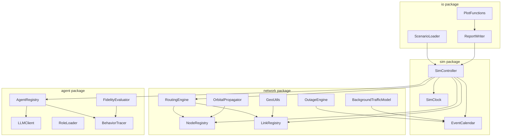
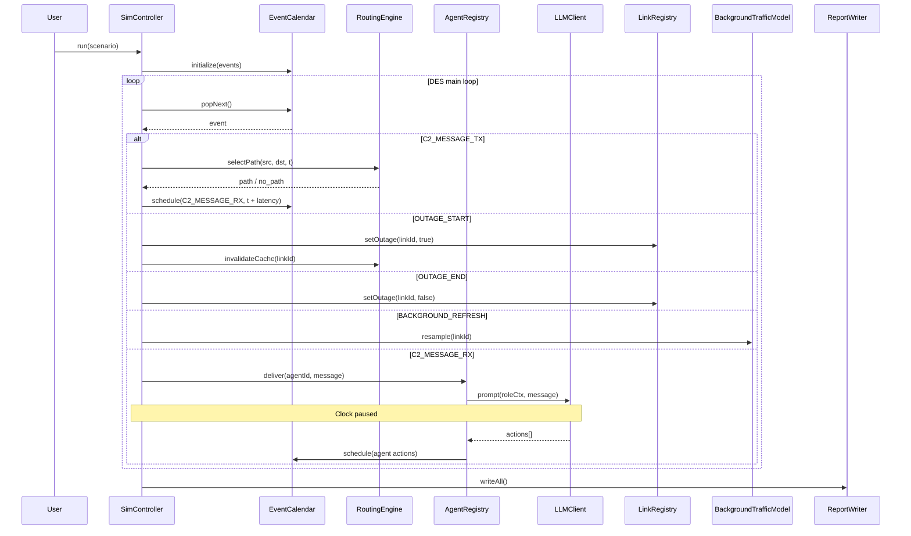

# Design Document: MATLAB Network Simulator

## Overview

The MATLAB Network Simulator is a discrete-event simulation (DES) application that models a heterogeneous global-scale communication network and, optionally, an agent-based human behavior emulation layer on top of it. The simulator is implemented entirely in MATLAB using object-oriented classes and runs as a standalone MATLAB application (no Simulink or SimEvents dependency).

The system has two major layers:

1. **Network Simulation Layer** — models nodes, links, outages, background traffic, C2 message routing, and statistics collection using a custom DES engine built around a min-heap event calendar.
2. **Agent Behavior Layer** — binds LLM-driven agents to network nodes, drives them through the simulation clock, and evaluates their behavior against reference specifications.

### Key Design Decisions

- **Pure MATLAB, no SimEvents**: The DES engine is implemented from scratch using a binary min-heap priority queue. This avoids a Simulink/SimEvents license dependency and keeps the codebase portable.
- **MATLAB `graph` object for routing**: MATLAB's built-in `graph` and `shortestpath` (Dijkstra, `'positive'` method) are used for path selection, giving O((V+E) log V) performance without external dependencies.
- **Vincenty's algorithm for geodesy**: WGS-84 geodesic distances are computed using Vincenty's iterative formula, which achieves sub-millimeter accuracy — well within the 0.1% requirement.
- **Keplerian two-body propagator for orbital mechanics**: Satellite positions are propagated using the classical two-body Keplerian model (`keplerian2ijk` from the Aerospace Toolbox, or a self-contained fallback). This is sufficient for the simulation's fidelity requirements.
- **OpenAI-compatible REST API for LLM calls**: Agents communicate with any OpenAI-compatible endpoint via MATLAB's `webwrite`/`webread`. The simulation clock pauses synchronously while awaiting each LLM response.
- **Struct-of-arrays for memory efficiency**: Node and link state is stored in struct-of-arrays rather than arrays of objects to keep memory usage within the 16 GB constraint for 1,000-node scenarios.

---

## Architecture

The simulator is organized into four top-level packages (MATLAB namespaces implemented as `+package` folders):

```
+sim/          — DES engine, event calendar, simulation controller
+network/      — node, link, routing, outage, background traffic models
+agent/        — LLM agent, role loader, behavior trace, fidelity evaluator
+io/           — scenario loader/saver, report writer, CSV exporter, plotting
```

### High-Level Component Diagram



### Simulation Execution Flow



---

## Components and Interfaces

### 2.1 `sim.EventCalendar`

A binary min-heap keyed on simulation time. All scheduled events are stored here.

```matlab
% Public interface
ec = sim.EventCalendar();
ec.schedule(event)          % insert event struct
event = ec.popNext()        % remove and return earliest event
tf = ec.isEmpty()           % logical
ec.reschedule(eventId, newTime)  % update time of pending event
```

**Event struct fields:**

| Field | Type | Description |
|---|---|---|
| `time` | double | Simulation time (seconds) |
| `type` | string | Event type enum (see below) |
| `id` | uint64 | Unique event identifier |
| `payload` | struct | Type-specific data |

**Event types:**

| Type | Payload fields |
|---|---|
| `C2_MESSAGE_TX` | `msgId`, `srcNodeId`, `dstNodeId`, `sizeBytes` |
| `C2_MESSAGE_RX` | `msgId`, `srcNodeId`, `dstNodeId`, `txTime`, `latencyMs` |
| `C2_MESSAGE_FAIL` | `msgId`, `srcNodeId`, `dstNodeId`, `reason` |
| `OUTAGE_START` | `linkId` |
| `OUTAGE_END` | `linkId` |
| `BACKGROUND_REFRESH` | `linkId` |
| `AGENT_IDLE_CHECK` | `agentId` |
| `SIM_END` | — |

### 2.2 `sim.SimController`

Owns the main DES loop and coordinates all subsystems.

```matlab
sc = sim.SimController(scenario);
sc.run()          % blocking; runs until SIM_END or time limit
sc.pause()        % sets pause flag; loop checks after each event
sc.resume()
sc.stop()
state = sc.inspect()   % returns snapshot of all node/link/queue state
```

The controller holds references to all subsystem objects and passes them into event handlers. It writes the event log incrementally to a pre-opened file handle to avoid memory accumulation for large runs.

### 2.3 `network.NodeRegistry`

Stores all node state in struct-of-arrays for memory efficiency.

```matlab
% Internal storage (struct-of-arrays)
nodes.id          % string array, N×1
nodes.type        % categorical: Stationary | Mobile
nodes.lat         % double, N×1 (degrees)
nodes.lon         % double, N×1 (degrees)
nodes.altM        % double, N×1 (meters)
nodes.trajectory  % cell array of trajectory structs (Mobile only)
nodes.keplerElems % struct array (satellite nodes only)
```

```matlab
nr = network.NodeRegistry(nodeStructArray);
pos = nr.getPosition(nodeId, simTimeSec)   % returns [lat, lon, altM]
nr.updatePositions(simTimeSec)             % batch-update all Mobile nodes
idx = nr.indexOf(nodeId)                   % integer index
```

### 2.4 `network.LinkRegistry`

Stores link state in struct-of-arrays.

```matlab
links.id              % string array
links.type            % categorical: GEO | LEO | Fiber | LOS
links.srcNodeId       % string array
links.dstNodeId       % string array
links.nominalLatencyMs % double
links.bandwidthBps    % double
links.outageRate      % double (events/sec)
links.outageDist      % struct: {type, params}
links.bgTrafficDist   % struct: {type, params}
links.isActive        % logical (not in outage, LOS coverage satisfied)
links.bgLoadFraction  % double (current background traffic fraction)
links.effectiveBwBps  % double (computed)
links.congestionPenaltyMs % double
```

```matlab
lr = network.LinkRegistry(linkStructArray);
lr.setOutage(linkId, tf)
lr.setLOSActive(linkId, tf)
lr.refreshBackground(linkId)
bw = lr.getEffectiveBandwidth(linkId)
lat = lr.getEffectiveLatency(linkId)   % nominal + congestion penalty
```

### 2.5 `network.RoutingEngine`

Wraps MATLAB's `graph` / `shortestpath` with an invalidation cache.

```matlab
re = network.RoutingEngine(nodeRegistry, linkRegistry);
[path, totalLatencyMs] = re.selectPath(srcId, dstId, simTimeSec)
re.invalidateCache(linkId)   % called on outage transitions
re.rebuildGraph()            % full rebuild from active links
```

**Design rationale**: The routing engine maintains a `digraph` object built from currently active links. Edge weights are `effectiveLatencyMs`. On each outage transition, only the affected edges are removed/added rather than rebuilding the full graph, keeping incremental updates O(degree) rather than O(E). A full rebuild is triggered on scenario load and after batch topology changes.

`shortestpath(G, src, dst, 'Method', 'positive')` implements Dijkstra and meets the 100 ms wall-clock requirement for 1,000 nodes / 10,000 links.

### 2.6 `network.OutageEngine`

Generates Poisson-distributed outage events and schedules them into the event calendar.

```matlab
oe = network.OutageEngine(linkRegistry, eventCalendar);
oe.scheduleNextOutage(linkId, currentTimeSec)
% Called internally when OUTAGE_END fires to schedule the next OUTAGE_START
```

Outage inter-arrival times are drawn from `exprnd(1/outageRate)`. Duration is sampled from the configured distribution:
- `exponential`: `exprnd(mean)`
- `lognormal`: `lognrnd(mu, sigma)`
- `fixed`: constant value

### 2.7 `network.BackgroundTrafficModel`

Samples background traffic load at each refresh interval.

```matlab
btm = network.BackgroundTrafficModel(linkRegistry, eventCalendar, refreshIntervalSec);
btm.resample(linkId)   % draw new load fraction, update linkRegistry
```

Supported distributions: `uniform` (`rand`), `normal` (`randn`, clamped to [0,1]), `lognormal` (`lognrnd`, clamped to [0,1]).

### 2.8 `network.GeoUtils`

Static utility functions for WGS-84 geodesy.

```matlab
distM = network.GeoUtils.vincenty(lat1, lon1, lat2, lon2)
% Vincenty's iterative formula on WGS-84 ellipsoid
% Accuracy: sub-millimeter (< 0.001% error)

tf = network.GeoUtils.isLOSVisible(mobileLat, mobileLon, mobileAltM, ...
                                    stationLat, stationLon, coverageRadiusM)
% Accounts for Earth curvature via WGS-84 ellipsoid model
```

### 2.9 `network.OrbitalPropagator`

Propagates satellite positions from Keplerian elements.

```matlab
[lat, lon, altM] = network.OrbitalPropagator.propagate(keplerElems, epochSec, simTimeSec)
```

**Keplerian elements struct:**

| Field | Description |
|---|---|
| `semiMajorAxisM` | Semi-major axis (meters) |
| `eccentricity` | Orbital eccentricity |
| `inclinationDeg` | Inclination (degrees) |
| `raanDeg` | Right ascension of ascending node (degrees) |
| `argPeriapsisDeg` | Argument of periapsis (degrees) |
| `trueAnomalyDeg` | True anomaly at epoch (degrees) |
| `epochSec` | Reference epoch (simulation seconds) |

The propagator solves Kepler's equation iteratively (Newton-Raphson, tolerance 1e-10 rad) to find eccentric anomaly, then converts to ECI Cartesian coordinates and finally to geodetic (WGS-84) latitude/longitude/altitude using the standard ECEF transformation.

### 2.10 `agent.LLMClient`

Wraps HTTP calls to an OpenAI-compatible chat completions endpoint.

```matlab
client = agent.LLMClient(config)
% config: struct with fields: baseUrl, apiKey, model, timeoutSec, maxTokens

response = client.complete(systemPrompt, userMessage)
% Synchronous blocking call via MATLAB webwrite/webread
% Returns struct: {content, finishReason, usageTokens}
```

The client constructs a JSON request body with `messages` array (system + user roles), sends it via `webwrite`, and parses the response. API key is read from the `config` struct (populated from environment variable `NETSIM_LLM_API_KEY` at startup, never logged).

### 2.11 `agent.AgentRegistry`

Manages all agents and their bindings to nodes.

```matlab
ar = agent.AgentRegistry(agentDefs, nodeRegistry, llmClient, eventCalendar);
ar.deliver(agentId, c2Message, simTimeSec)
% Calls LLM, records actions in BehaviorTracer, schedules resulting C2 messages
ar.checkIdle(agentId, simTimeSec)
% Fires idle-timeout action if no message received within idleTimeoutSec
```

### 2.12 `agent.RoleLoader`

Loads and validates Role_Definition Markdown files.

```matlab
role = agent.RoleLoader.load(filePath)
% Returns struct: {name, sourceRef, fullMarkdown}
% Validates: file exists, non-empty, role name extractable (first H1 heading)
```

### 2.13 `agent.BehaviorTracer`

Records Agent_Actions in time order.

```matlab
bt = agent.BehaviorTracer(agentId, role);
bt.record(simTimeSec, triggerEventId, actionType, targetAgentId, msgId)
trace = bt.getTrace()   % returns table with all recorded actions
bt.exportCSV(filePath)
```

### 2.14 `agent.FidelityEvaluator`

Compares a BehaviorTrace against a Reference_Behavior specification.

```matlab
fe = agent.FidelityEvaluator(referenceBehavior);
result = fe.evaluate(behaviorTrace, eventLog)
% result: struct with fidelityScore, missingActions, extraActions, deviations
% Network-constrained missing actions are annotated, not penalized
```

### 2.15 `io.ScenarioLoader`

Loads and validates JSON scenario files.

```matlab
scenario = io.ScenarioLoader.load(filePath)
% Validates JSON syntax, node defs, link defs, agent defs, orbital elements
% Throws descriptive errors with file path + field path on validation failure

io.ScenarioLoader.save(scenario, filePath)
```

### 2.16 `io.ReportWriter`

Writes all output files at simulation end.

```matlab
rw = io.ReportWriter(outputDir, scenarioName);
rw.writeEventLog(eventLog)          % CSV
rw.writeStatisticsReport(stats)     % JSON
rw.writeEvaluationReport(evalResult) % JSON
rw.writeBehaviorTraces(agentRegistry) % CSV per agent
```

### 2.17 `io.PlotFunctions`

Standalone MATLAB functions for visualization.

```matlab
io.PlotFunctions.latencyHistogram(statsReport)
% Plots histogram of delivered C2 message latencies

io.PlotFunctions.outageGantt(statsReport, linkIds)
% Plots per-link outage timelines as Gantt chart

io.PlotFunctions.fidelityBoxPlot(evalReports)
% Plots per-agent fidelity scores across multiple runs as box-and-whisker
```

---

## Data Models

### 4.1 Scenario File (JSON)

```json
{
  "scenarioName": "string",
  "simulationDurationSec": 3600,
  "nodes": [
    {
      "id": "string",
      "type": "Stationary | Mobile",
      "lat": 40.7128,
      "lon": -74.0060,
      "altM": 0.0,
      "trajectory": null,
      "keplerElements": null
    }
  ],
  "links": [
    {
      "id": "string",
      "type": "GEO_Satellite | LEO_Satellite | Fiber | Line_Of_Sight",
      "srcNodeId": "string",
      "dstNodeId": "string",
      "nominalLatencyMs": 270.0,
      "bandwidthBps": 1e9,
      "outageRate": 0.001,
      "outageDuration": { "distribution": "exponential", "meanSec": 60 },
      "backgroundTraffic": { "distribution": "uniform", "min": 0.1, "max": 0.4 },
      "coverageRadiusM": null
    }
  ],
  "c2Messages": [
    {
      "id": "string",
      "srcNodeId": "string",
      "dstNodeId": "string",
      "sizeBytes": 512,
      "scheduledTimeSec": 100.0
    }
  ],
  "agents": [
    {
      "id": "string",
      "nodeId": "string",
      "roleDefinitionFile": "path/to/role.md",
      "idleTimeoutSec": 300
    }
  ],
  "referenceBehaviorFile": "path/to/reference.json",
  "routingPolicy": null
}
```

**Trajectory struct** (for Mobile nodes):

```json
{
  "type": "waypoints",
  "waypoints": [
    { "timeSec": 0, "lat": 40.0, "lon": -74.0, "altM": 10000 },
    { "timeSec": 3600, "lat": 51.5, "lon": -0.1, "altM": 10000 }
  ]
}
```

Position between waypoints is linearly interpolated in geodetic coordinates.

**Keplerian elements** (for satellite nodes):

```json
{
  "semiMajorAxisM": 6778000,
  "eccentricity": 0.001,
  "inclinationDeg": 53.0,
  "raanDeg": 120.0,
  "argPeriapsisDeg": 0.0,
  "trueAnomalyDeg": 45.0,
  "epochSec": 0.0
}
```

### 4.2 Event Log (CSV)

```
eventId,simTimeSec,eventType,linkId,msgId,srcNodeId,dstNodeId,latencyMs,reason
```

### 4.3 Statistics Report (JSON)

```json
{
  "scenarioName": "string",
  "simStartTimeSec": 0,
  "simEndTimeSec": 3600,
  "wallClockDurationSec": 12.4,
  "c2Messages": {
    "scheduled": 10000,
    "delivered": 9850,
    "failed": 150
  },
  "latency": {
    "meanMs": 312.4,
    "medianMs": 290.1,
    "p95Ms": 620.0
  },
  "perLink": [
    {
      "linkId": "string",
      "meanEffectiveBwBps": 8.5e8,
      "meanBgLoadFraction": 0.15,
      "totalC2MessagesRouted": 4200,
      "totalOutageDurationSec": 180.0,
      "outageFraction": 0.05
    }
  ],
  "agentFidelity": {
    "mean": 0.87,
    "min": 0.72,
    "max": 0.95
  }
}
```

### 4.4 Evaluation Report (JSON)

```json
{
  "runId": "uuid-string",
  "timestamp": "ISO-8601",
  "scenarioName": "string",
  "agents": [
    {
      "agentId": "string",
      "role": "string",
      "fidelityScore": 0.87,
      "missingActions": [
        { "actionType": "string", "expectedTimeSec": 120.0, "reason": "network-constrained | agent-failure" }
      ],
      "extraActions": [
        { "actionType": "string", "observedTimeSec": 135.0 }
      ],
      "deviations": [
        { "actionType": "string", "expectedTimeSec": 120.0, "observedTimeSec": 145.0, "deviationSec": 25.0 }
      ]
    }
  ]
}
```

### 4.5 Reference Behavior File (JSON)

```json
{
  "scenarioName": "string",
  "roles": [
    {
      "role": "Aircrew",
      "ordering": "strict | unordered",
      "actions": [
        { "actionType": "string", "triggerEvent": "string", "expectedTimeSec": 120.0 }
      ]
    }
  ]
}
```

### 4.6 Behavior Trace (CSV)

```
simTimeSec,agentId,role,actionType,targetAgentId,msgId
```

---

## Correctness Properties

*A property is a characteristic or behavior that should hold true across all valid executions of a system — essentially, a formal statement about what the system should do. Properties serve as the bridge between human-readable specifications and machine-verifiable correctness guarantees.*

### Property 1: Scenario Round-Trip Fidelity

*For any* valid scenario struct, serializing it to JSON via `ScenarioLoader.save` and then deserializing it via `ScenarioLoader.load` SHALL produce a scenario struct that is field-for-field equivalent to the original, including all node definitions, link definitions, agent assignments, and traffic parameters.

**Validates: Requirements 7.5**

### Property 2: Reference Behavior Round-Trip Fidelity

*For any* valid reference behavior specification, saving it to JSON and then loading it SHALL produce a specification that is field-for-field equivalent to the original, including all role entries, ordering constraints, and expected action sequences.

**Validates: Requirements 14.5**

### Property 3: Evaluation Report Consistency

*For any* valid Evaluation Report JSON file produced by the simulator, loading the file and re-computing the per-agent fidelity summary statistics (mean, min, max Fidelity_Score across all agents) SHALL produce values identical to those recorded in the file's `agentFidelity` summary block.

**Validates: Requirements 16.4**

### Property 4: Fidelity Score Correctness

*For any* agent behavior trace and reference behavior specification, the computed Fidelity_Score SHALL be a value in the closed interval [0.0, 1.0], and SHALL equal the fraction of required Reference_Behavior actions that appear in the Behavior_Trace (accounting for strict ordering constraints where configured). The score SHALL be consistent with the counts of matched, missing, and extra actions reported in the Evaluation_Report.

**Validates: Requirements 15.1, 15.2, 15.3**

### Property 5: Network-Constrained Annotation Does Not Penalize Fidelity

*For any* simulation run where a network outage or congestion event prevents delivery of a C2_Message that would have triggered a Reference_Behavior action, the Fidelity_Score for the affected agent SHALL be identical to the score computed when that action is excluded from the reference set entirely, and the missing action SHALL be annotated with reason `"network-constrained"` in the Evaluation_Report.

**Validates: Requirements 15.4**

### Property 6: Routing Selects Minimum Latency Active Path

*For any* network topology with at least two active paths between a source and destination node, the routing engine SHALL select the path whose total effective latency (sum of nominal link latencies plus congestion penalties) is less than or equal to the total effective latency of every other available active path.

**Validates: Requirements 5.2, 6.2**

### Property 7: Routing Excludes Outage Links

*For any* network topology with any combination of links in outage state, the routing engine SHALL never include a link that is currently in outage state in a selected path, regardless of whether that link would otherwise offer lower latency.

**Validates: Requirements 6.1**

### Property 8: Messages Fail on Unavailable Paths

*For any* C2_Message scheduled when no active path exists between its source and destination nodes, the simulator SHALL record a `C2_MESSAGE_FAIL` event in the Event_Log with reason `"no available path"`, and no `C2_MESSAGE_RX` event SHALL be recorded for that message.

**Validates: Requirements 4.4, 5.5**

### Property 9: GEO Satellite Latency Floor

*For any* link of type `GEO_Satellite`, the nominal one-way latency value stored in the link registry SHALL be no less than 270 ms, and the effective latency used for routing and message delivery computation SHALL be no less than 270 ms.

**Validates: Requirements 2.2**

### Property 10: Fiber Link Latency from Geographic Distance

*For any* pair of nodes connected by a `Fiber` link, the computed nominal latency SHALL equal the WGS-84 geodesic distance between the two nodes divided by the propagation speed of 200,000 km/s, within floating-point precision.

**Validates: Requirements 2.4**

### Property 11: Effective Bandwidth Formula and Congestion

*For any* link with total bandwidth B and background traffic load fraction f in [0, 1], the effective bandwidth SHALL equal B × (1 − f). When f ≥ 1.0, effective bandwidth SHALL be zero and the link SHALL be marked as congested, applying the configured congestion latency penalty to all C2_Messages traversing it.

**Validates: Requirements 3.2, 3.3**

### Property 12: WGS-84 Distance Accuracy

*For any* pair of geographic positions on the WGS-84 ellipsoid, the distance computed by `GeoUtils.vincenty` SHALL differ from the reference geodesic distance by no more than 0.1%, including near-antipodal point pairs and positions at extreme latitudes.

**Validates: Requirements 10.1**

### Property 13: LOS Visibility Accounts for Earth Curvature

*For any* mobile node position and stationary node position where the straight-line distance between them exceeds the geometric horizon distance computed from the WGS-84 ellipsoid, `GeoUtils.isLOSVisible` SHALL return false, and the corresponding LOS link SHALL be marked inactive.

**Validates: Requirements 2.5, 10.2**

### Property 14: Orbital Period Round-Trip

*For any* satellite node with a valid circular Keplerian orbit (eccentricity = 0), propagating the orbital position forward by exactly one orbital period T = 2π√(a³/μ) SHALL return a position within 1 meter of the initial position, where a is the semi-major axis and μ is Earth's gravitational parameter.

**Validates: Requirements 10.3**

### Property 15: Agent Message Delivery Timing

*For any* C2_Message sent by an agent with a known transmission time and computed path latency, the receiving agent SHALL be notified of the message at simulation time equal to the transmission time plus the total path latency, not at the transmission time.

**Validates: Requirements 12.4**

### Property 16: Behavior Trace Completeness

*For any* agent action recorded during a simulation run, the Behavior_Trace SHALL contain an entry with all required fields (simulation timestamp, agent identifier, role, action type, target agent identifier, message identifier), and the CSV export of the trace SHALL contain all required columns with no missing values for mandatory fields.

**Validates: Requirements 13.3, 16.2**

### Property 17: Event Time Ordering

*For any* simulation run, the sequence of events processed by the DES engine SHALL be non-decreasing in simulation time, and all Agent_Actions recorded in Behavior_Traces SHALL have timestamps that are consistent with (greater than or equal to) the timestamps of their triggering network events in the Event_Log.

**Validates: Requirements 13.5**

### Property 18: Batch Evaluation Report Run Uniqueness

*For any* batch of two or more Mission_Scenario runs, the combined Evaluation_Report SHALL contain one entry per run, each with a distinct run identifier and a distinct ISO-8601 timestamp, and the union of per-run fidelity scores SHALL match the individual run reports.

**Validates: Requirements 16.5**

### Property 19: Statistics Report Completeness

*For any* completed simulation run, the generated Statistics_Report SHALL contain all required top-level fields (scenario name, sim start/end times, wall-clock duration, C2 message counts, latency statistics) and a per-link entry for every link in the scenario, each containing mean effective bandwidth, mean background load, total C2 messages routed, and total outage duration.

**Validates: Requirements 9.1, 9.2**

---

## Error Handling

All validation errors are raised as MATLAB exceptions using `error(identifier, message, ...)` with structured identifiers of the form `netsim:component:errorType`. The simulator never silently swallows errors during scenario loading.

| Condition | Identifier | Behavior |
|---|---|---|
| Missing/malformed Mobile_Node trajectory | `netsim:node:malformedTrajectory` | Report node ID + field, halt loading |
| Link references non-existent node | `netsim:link:unknownNode` | Report link ID + node ID, halt loading |
| Invalid background traffic distribution params | `netsim:link:invalidBgParams` | Report link ID + param name, halt loading |
| JSON syntax error in scenario file | `netsim:io:jsonSyntaxError` | Report file path + approximate location, halt loading |
| Missing/invalid orbital elements | `netsim:node:invalidKeplerElements` | Report node ID + field, halt loading |
| Role definition file unreadable or empty | `netsim:agent:roleLoadError` | Report file path, halt loading |
| Agent assigned to non-existent node | `netsim:agent:unknownNode` | Report agent ID + node ID, halt loading |
| Reference behavior references unassigned role | `netsim:agent:unassignedRole` | Log warning, continue loading |
| LLM API call failure | `netsim:agent:llmError` | Log warning with HTTP status, record agent action as `LLM_FAILURE`, continue simulation |
| No path available for C2 message | — | Record `C2_MESSAGE_FAIL` event with reason `"no available path"`, continue |

---

## Testing Strategy

### Unit Tests

Unit tests cover individual component logic with specific examples and edge cases. They are organized under a `tests/` directory mirroring the package structure. Unit tests focus on concrete examples and edge conditions; property-based tests handle broad input coverage.

Key unit test areas:
- `GeoUtils.vincenty`: known geodesic distances (equatorial, polar, antipodal near-miss, same point)
- `OrbitalPropagator.propagate`: known circular orbit positions at quarter-period intervals; GEO altitude check
- `OutageEngine`: verify Poisson inter-arrival statistics over many samples; all three duration distributions
- `BackgroundTrafficModel`: verify distribution sampling stays within [0,1]; congestion threshold behavior
- `RoutingEngine.selectPath`: small hand-crafted topologies with known shortest paths; cache invalidation on outage transition
- `FidelityEvaluator.evaluate`: strict-ordered and unordered reference behavior cases; network-constrained annotation
- `ScenarioLoader.load` / `save`: round-trip on representative scenario files; JSON syntax error reporting
- `RoleLoader.load`: valid Markdown file; empty file; file without H1 heading
- `io.ReportWriter`: verify JSON output matches expected schema; CSV column headers

### Property-Based Tests

Property-based tests use the [matlab-prop-test](https://github.com/matlab-deep-learning/matlab-prop-test) library (or equivalent) with a minimum of 100 iterations per property. Each test is tagged with a comment referencing the design property it validates.

**Feature: matlab-network-sim**

| Property | Test description | Generator |
|---|---|---|
| Property 1 | Scenario round-trip | Random scenario structs with varying node/link counts (1–50 nodes, 0–200 links) |
| Property 2 | Reference behavior round-trip | Random reference behavior specs with 1–10 roles, strict and unordered ordering |
| Property 3 | Evaluation report consistency | Random evaluation results with 1–20 agents and random fidelity scores |
| Property 4 | Fidelity score correctness | Random trace/reference pairs with known overlap fractions |
| Property 5 | Network-constrained annotation | Random scenarios with injected network failures on specific message paths |
| Property 6 | Routing selects minimum latency | Random topologies with 2–20 nodes, 2+ active paths between source/destination |
| Property 7 | Routing excludes outage links | Random topologies with random subsets of links in outage state |
| Property 8 | Messages fail on unavailable paths | Random topologies with all paths blocked (all links in outage) |
| Property 9 | GEO latency floor | Random GEO link configurations with varying latency values |
| Property 10 | Fiber latency from distance | Random node pairs with fiber links, verify latency = distance / 200000 km/s |
| Property 11 | Effective bandwidth formula | Random bandwidth and load fraction pairs in [0, 2] |
| Property 12 | WGS-84 distance accuracy | Random lat/lon pairs including edge cases (poles, equator, antipodal) |
| Property 13 | LOS visibility and Earth curvature | Random positions beyond geometric horizon, verify LOS returns false |
| Property 14 | Orbital period round-trip | Random circular orbit parameters (varying altitude, inclination, RAAN) |
| Property 15 | Agent message delivery timing | Random messages with known latencies, verify delivery time = tx_time + latency |
| Property 16 | Behavior trace completeness | Random agent action sequences, verify all required fields present in trace and CSV |
| Property 17 | Event time ordering | Random simulation runs, verify event log and behavior trace timestamps non-decreasing |
| Property 18 | Batch evaluation report uniqueness | Random sets of 2–10 evaluation reports, verify unique run IDs and timestamps |
| Property 19 | Statistics report completeness | Random simulation results, verify all required fields present in statistics report |

Tag format for each test: `% Feature: matlab-network-sim, Property N: <property_text>`

### Integration Tests

Integration tests exercise the full simulation pipeline on small scenarios:
- A 5-node, 6-link scenario with one GEO satellite link, one fiber link, and one LOS link
- Verify event log CSV is written and parseable
- Verify statistics report JSON matches expected schema and all required fields are present
- Verify LLM agent integration (using a mock HTTP server returning canned responses) produces behavior traces
- Verify fidelity evaluation produces a score in [0,1] and an evaluation report with all required fields
- Verify LOS link transitions to outage when mobile node moves outside coverage radius
- Verify batch run produces combined evaluation report with unique run identifiers

### Performance Tests

- 1,000-node, 10,000-link scenario: verify routing completes within 100 ms wall-clock per message (Requirement 6.4)
- 100,000 C2 messages scheduled: verify simulation completes without memory errors on a 16 GB system (Requirement 5.6)
- Measure memory footprint of NodeRegistry and LinkRegistry at maximum scale (Requirement 1.3)

### Smoke Tests

- Plotting functions (`latencyHistogram`, `outageGantt`, `fidelityBoxPlot`): call with sample data, verify no MATLAB error (Requirements 9.4, 9.5, 15.5)
- Simulation start/pause/resume/stop API: verify state transitions work correctly (Requirement 8.2)
