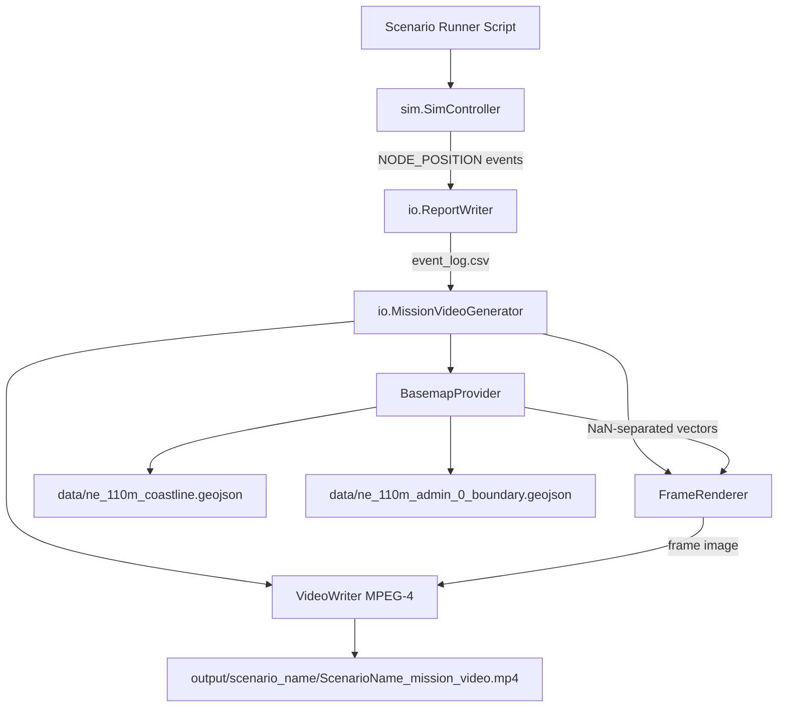

# Design Document: Mission Video Generator

## Overview

The Mission Video Generator produces animated MP4 videos from simulation event logs containing NODE_POSITION data. It renders node positions over time on a geographic map using Natural Earth coastline/border data and MATLAB's built-in `geoaxes`/`geoplot`/`geoscatter` functions — no Mapping Toolbox required.

The feature consists of four main components:

1. **Position event generation** — SimController records NODE_POSITION events at configurable intervals during simulation
2. **Basemap data acquisition** — Downloads and caches Natural Earth GeoJSON for coastlines and borders
3. **Frame rendering** — Draws geographic frames with node markers, trajectories, links, and time annotations
4. **Video assembly** — Combines rendered frames into an MP4 using VideoWriter

The system integrates with the existing `+io` package and output directory structure, following the same patterns as `io.ReportWriter` and `io.PlotFunctions`.

## Architecture



### Data Flow

1. A scenario runner script (e.g., `run_dragon_cart_video.m`) loads a scenario, sets `positionUpdateIntervalSec > 0` on the SimController, and runs the simulation.
2. During simulation, the SimController records NODE_POSITION events for every node at each interval tick.
3. After simulation, `io.ReportWriter` writes the event log CSV (already implemented).
4. The runner invokes `io.MissionVideoGenerator` with the event log CSV path.
5. `MissionVideoGenerator` parses NODE_POSITION rows, acquires basemap data, renders frames sequentially, and writes the MP4.

### Key Design Decisions

- **Post-hoc video generation from CSV** — The video generator reads the event log CSV after simulation completes rather than rendering during simulation. This decouples video generation from the DES loop, allows re-generation without re-running, and avoids slowing the simulation.
- **Internal component classes as private methods** — BasemapProvider and FrameRenderer logic lives as private methods within `MissionVideoGenerator` rather than separate class files. This keeps the public API surface minimal (one class) while maintaining internal separation of concerns.
- **NaN-delimited coordinate vectors** — GeoJSON polygons are converted to NaN-separated lat/lon vectors, which `geoplot` handles natively for multi-segment lines. This avoids per-polygon loop overhead during rendering.
- **Interpolation between position snapshots** — For frame times between recorded position timestamps, linear interpolation is used. This produces smooth motion without requiring position data at every frame time.
- **No Mapping Toolbox dependency** — Uses only `geoaxes`, `geoplot`, and `geoscatter` from base MATLAB R2025b. The Natural Earth GeoJSON provides the geographic context that would otherwise require the Mapping Toolbox.

## Components and Interfaces

### io.MissionVideoGenerator

The primary public class. Resides at `+io/MissionVideoGenerator.m`.

```matlab
classdef MissionVideoGenerator < handle
    properties (Access = private)
        outputDir       % string — output directory path
        scenarioName    % string — scenario name for filename construction
        config          % struct — validated configuration
        coastlineLat    % double vector — NaN-separated coastline latitudes
        coastlineLon    % double vector — NaN-separated coastline longitudes
        boundaryLat     % double vector — NaN-separated boundary latitudes
        boundaryLon     % double vector — NaN-separated boundary longitudes
    end

    methods (Access = public)
        function obj = MissionVideoGenerator(outputDir, scenarioName, config)
            % Constructor — validates config, acquires basemap data
        end

        function generate(obj, eventLogCsvPath, scenarioStruct)
            % Main entry point — parses CSV, renders frames, writes MP4
            % scenarioStruct is optional — used for trajectory/link data
        end
    end

    methods (Access = private)
        % Basemap acquisition
        function loadBasemapData(obj)
        function [lat, lon] = downloadAndParseGeoJSON(obj, url, cacheFilename)
        function [lat, lon] = parseGeoJSON(obj, geojsonStruct)

        % Event log parsing
        function posLog = parsePositionLog(obj, csvPath)
        function snapshots = groupByTimestamp(obj, posLog)

        % Frame rendering
        function fig = createFigure(obj)
        function renderFrame(obj, fig, ax, snapshot, simTimeSec, scenarioStruct)
        function marker = getNodeMarker(obj, nodeId, scenarioStruct)
        function pos = interpolatePosition(obj, snapshots, nodeId, targetTime)

        % Video assembly
        function writeVideo(obj, snapshots, scenarioStruct)

        % Configuration validation
        function validConfig = validateConfig(obj, config)

        % Utility
        function timeStr = formatSimTime(obj, simTimeSec)
        function [latLim, lonLim] = computeBounds(obj, snapshots, padding)
        function outputPath = buildOutputPath(obj)
    end
end
```

### Constructor Interface

Matches the `io.ReportWriter` pattern:

```matlab
vg = io.MissionVideoGenerator(outputDir, scenarioName);
vg = io.MissionVideoGenerator(outputDir, scenarioName, config);
```

- `outputDir` — directory where the MP4 will be written (created if needed)
- `scenarioName` — used for output filename (e.g., `'DragonCartImproved'` → `DragonCartImproved_mission_video.mp4`)
- `config` — optional struct with fields: `frameRate`, `speedupFactor`, `resolution`, `outputDir`, `showLinks`

### generate() Method

```matlab
vg.generate(eventLogCsvPath)
vg.generate(eventLogCsvPath, scenarioStruct)
```

- `eventLogCsvPath` — path to the event log CSV containing NODE_POSITION rows
- `scenarioStruct` — optional loaded scenario struct (from `io.ScenarioLoader.load`); provides trajectory waypoints and link definitions for rendering trajectories and active links

### SimController Integration

The existing `handleNodePosition` method and `scheduleNextPositionUpdate` method in `sim.SimController` already implement position event recording. The `positionUpdateIntervalSec` property controls the interval. No changes to SimController are needed — the feature is already implemented and tested.

### Scenario Runner Scripts

Two new scripts in the project root:

**`run_dragon_cart_video.m`**:
```matlab
% 1. Load scenario
scenario = io.ScenarioLoader.load('scenarios/dragon_cart/dragon_cart_improved.json');
% 2. Construct SimController, set positionUpdateIntervalSec = 10
sc = sim.SimController(scenario);
sc.positionUpdateIntervalSec = 10;
% 3. Run simulation
sc.run();
% 4. Write event log
rw = io.ReportWriter('output/dragon_cart_improved', 'DragonCartImproved');
rw.writeEventLog(sc.eventLog);
% 5. Generate video
vg = io.MissionVideoGenerator('output/dragon_cart_improved', 'DragonCartImproved');
vg.generate(fullfile('output/dragon_cart_improved', 'DragonCartImproved_event_log.csv'), scenario);
% 6. Print output path
fprintf('Video: %s\n', fullfile(pwd, 'output/dragon_cart_improved', 'DragonCartImproved_mission_video.mp4'));
```

**`run_airdrop_video.m`** follows the same pattern for the airdrop mission scenario.

## Data Models

### Position_Log Entry

Parsed from CSV NODE_POSITION rows:

```matlab
posEntry.nodeId     = "C130"        % string — from linkId column
posEntry.lat        = 41.6600       % double — parsed from msgId column
posEntry.lon        = -70.5200      % double — parsed from srcNodeId column
posEntry.altM       = 7500.0        % double — parsed from dstNodeId column
posEntry.simTimeSec = 10.0          % double — from simTimeSec column
```

### Position Snapshot

Grouped by timestamp:

```matlab
snapshot.simTimeSec = 10.0                  % double — the timestamp
snapshot.positions  = [posEntry1, posEntry2, ...]  % struct array — one per node
```

### Configuration Struct

```matlab
config.frameRate     = 30           % integer 1–120, default 30
config.speedupFactor = 60           % double 0.1–1000, default 60
config.resolution    = [1920 1080]  % 1x2 integer [width height], default [1920 1080]
config.outputDir     = pwd          % string, default current directory
config.showLinks     = true         % logical, default true
```

### Basemap Coordinate Vectors

GeoJSON polygons are flattened into NaN-separated vectors:

```matlab
% For a GeoJSON with 3 polygons:
lat = [poly1_lat1, poly1_lat2, ..., NaN, poly2_lat1, ..., NaN, poly3_lat1, ...]
lon = [poly1_lon1, poly1_lon2, ..., NaN, poly2_lon1, ..., NaN, poly3_lon1, ...]
```

### Video Frame Timing

```matlab
timeStepSec   = speedupFactor / frameRate    % simulation seconds per frame
totalFrames   = ceil((simulationDurationSec / speedupFactor) * frameRate)
frameSimTimes = (0:totalFrames-1) * timeStepSec  % simulation time for each frame
```

### Output File Naming

```
output/{scenario_name}/{ScenarioName}_mission_video.mp4
```

Examples:
- `output/dragon_cart_improved/DragonCartImproved_mission_video.mp4`
- `output/airdrop_mission/AirdropMission_mission_video.mp4`

## Correctness Properties

*A property is a characteristic or behavior that should hold true across all valid executions of a system — essentially, a formal statement about what the system should do. Properties serve as the bridge between human-readable specifications and machine-verifiable correctness guarantees.*

### Property 1: Position event scheduling produces correct timestamps

*For any* `positionUpdateIntervalSec` > 0 and `simulationDurationSec` > `positionUpdateIntervalSec`, the set of NODE_POSITION timestamps recorded in the event log SHALL start at `positionUpdateIntervalSec`, advance by `positionUpdateIntervalSec` each step, and the last timestamp SHALL be strictly less than `simulationDurationSec`.

**Validates: Requirements 1.1**

### Property 2: NODE_POSITION serialization format

*For any* valid node position (nodeId as non-empty string, lat in [-90, 90], lon in [-180, 180], altM ≥ 0), the serialized CSV row SHALL have: eventType = "NODE_POSITION", linkId = nodeId, msgId = lat formatted to exactly 4 decimal places, srcNodeId = lon formatted to exactly 4 decimal places, dstNodeId = altM formatted to exactly 1 decimal place, latencyMs empty, and reason empty.

**Validates: Requirements 1.2**

### Property 3: GeoJSON coordinate extraction preserves structure

*For any* valid GeoJSON FeatureCollection containing N polygons, parsing SHALL produce two numeric vectors (lat, lon) where polygon boundaries are separated by exactly one NaN value, resulting in exactly N-1 NaN delimiters, and all original coordinate values are preserved in order.

**Validates: Requirements 2.4**

### Property 4: Node type determines marker shape

*For any* node, the marker assignment function SHALL return: circle ('o') for Stationary nodes, triangle ('^') for Mobile nodes with waypoint trajectories (no keplerElements), and pentagram ('p') for satellite nodes (Mobile nodes with keplerElements).

**Validates: Requirements 3.2**

### Property 5: Simulation time formatting

*For any* non-negative simulation time in seconds, the formatted time string SHALL equal `sprintf('%02d:%02d:%02d', floor(t/3600), floor(mod(t,3600)/60), floor(mod(t,60)))`.

**Validates: Requirements 3.4**

### Property 6: Geographic bounds encompass all positions with padding

*For any* set of node positions across all timestamps and any padding value ≥ 0, the computed latitude limits SHALL satisfy `minLat - padding ≤ latLim(1)` and `latLim(2) ≥ maxLat + padding`, and similarly for longitude limits.

**Validates: Requirements 3.5**

### Property 7: Total video frame count formula

*For any* `simulationDurationSec` > 0, `speedupFactor` in [0.1, 1000], and `frameRate` in [1, 120], the total number of video frames SHALL equal `ceil((simulationDurationSec / speedupFactor) * frameRate)`.

**Validates: Requirements 4.3**

### Property 8: Output path construction

*For any* scenario name string, the output MP4 file path SHALL equal `fullfile(outputDir, [scenarioName, '_mission_video.mp4'])` where outputDir is the configured output directory.

**Validates: Requirements 4.4, 8.2**

### Property 9: Frame time advancement

*For any* `speedupFactor` and `frameRate`, frame N (0-indexed) SHALL correspond to simulation time `N * (speedupFactor / frameRate)` seconds.

**Validates: Requirements 4.8**

### Property 10: Position log parsing extracts and maps correctly

*For any* event log CSV containing a mix of NODE_POSITION and other event types (with some NODE_POSITION rows having non-numeric lat/lon/altM values), parsing SHALL: extract only rows where eventType equals "NODE_POSITION", skip rows with non-numeric coordinate fields, and for valid rows map linkId → nodeId, msgId → lat (numeric), srcNodeId → lon (numeric), dstNodeId → altM (numeric).

**Validates: Requirements 5.1, 5.6**

### Property 11: Timestamp grouping produces unique sorted snapshots

*For any* parsed position log with K distinct simTimeSec values and M total valid entries, grouping SHALL produce exactly K snapshots sorted in ascending simTimeSec order, where the sum of entries across all snapshots equals M, and each snapshot contains exactly the nodeIds present at that timestamp.

**Validates: Requirements 5.3, 5.4**

### Property 12: Configuration validation rejects invalid values with descriptive errors

*For any* configuration struct where frameRate is outside [1, 120], or speedupFactor is outside [0.1, 1000], or resolution is not a 1×2 integer array with width in [1, 7680] and height in [1, 4320], validation SHALL reject the configuration and the error message SHALL contain the invalid field name and the expected constraint.

**Validates: Requirements 7.4, 7.5**

## Error Handling

| Error Condition | Error Identifier | Behavior |
|---|---|---|
| Output directory cannot be created or file cannot be written | `netsim:io:fileWriteError` | Throw structured error with failing path |
| CSV file does not exist or cannot be read | `netsim:io:fileReadError` | Return error with file path and reason |
| No NODE_POSITION rows in event log | `netsim:io:noPositionData` | Return error suggesting `positionUpdateIntervalSec > 0` |
| Invalid configuration value | `netsim:io:invalidConfig` | Return error naming the field and expected constraint |
| Network error during GeoJSON download | `netsim:io:downloadError` | Return error with URL and underlying reason |
| Corrupted cached GeoJSON file | (internal recovery) | Delete corrupted file, re-attempt download |
| Frame rendering error during video generation | `netsim:io:videoRenderError` | Close VideoWriter, delete partial file, report frame number |
| Node position cannot be computed for frame time | (graceful skip) | Omit node from frame, no error raised |

### Resource Cleanup Strategy

Video generation uses a try/catch pattern to ensure cleanup on error:

```matlab
try
    % Open VideoWriter, create figure
    % Render frames in loop
    % Close VideoWriter
catch ME
    % Close VideoWriter if open
    % Delete partial MP4 file if exists
    % Close/delete figure
    % Re-throw with frame number context
end
```

## Testing Strategy

### Unit Tests (Example-Based)

Located in `tests/io/MissionVideoGeneratorTest.m`:

- **Constructor tests**: Verify default config values, outputDir/scenarioName storage, directory creation
- **Basemap caching**: Verify cached file is loaded from disk, corrupted file triggers re-download
- **Error conditions**: Missing CSV file, empty position data, invalid config values, unwritable output directory
- **Rendering specifics**: Figure visibility off, legend presence, link color assignment, trajectory dashed lines
- **Integration**: End-to-end test with a small synthetic event log (5 nodes, 10 timestamps)

### Property-Based Tests

Library: Custom MATLAB property test harness using `randi`/`rand` generators with 100+ iterations per property.

Each property test runs a minimum of **100 iterations** with randomly generated inputs.

Tag format: `% Feature: mission-video-generator, Property N: <property text>`

| Property | Generator Strategy |
|---|---|
| 1: Position scheduling | Random interval (1–100), duration (100–10000) |
| 2: Serialization format | Random nodeId (alphanumeric), lat [-90,90], lon [-180,180], altM [0,50000] |
| 3: GeoJSON extraction | Random polygon count (1–20), random coordinate count per polygon (3–50) |
| 4: Marker assignment | Random node type from {Stationary, Mobile+waypoints, Mobile+kepler} |
| 5: Time formatting | Random seconds [0, 360000] |
| 6: Bounds computation | Random position sets (1–50 positions), random padding [0, 10] |
| 7: Frame count | Random duration (1–100000), speedup (0.1–1000), frameRate (1–120) |
| 8: Output path | Random scenario names (alphanumeric, 3–30 chars) |
| 9: Frame time advancement | Random speedup/frameRate combinations, verify first 100 frames |
| 10: Position log parsing | Random event logs with 50–500 rows, mix of event types, some invalid |
| 11: Timestamp grouping | Random position logs with 5–50 timestamps, 3–20 nodes |
| 12: Config validation | Random invalid values for each field, verify rejection and error content |

### Integration Tests

- **Dragon Cart scenario**: Run with `positionUpdateIntervalSec = 10`, verify 14380 NODE_POSITION rows
- **End-to-end video generation**: Generate a short video (5 seconds sim time, speedup=5, frameRate=2) from synthetic data, verify MP4 file exists and has expected size > 0
- **Basemap download**: Verify Natural Earth GeoJSON downloads and parses (network-dependent, skip in CI)

### Test File Organization

```
tests/io/
├── MissionVideoGeneratorTest.m          % Unit + example-based tests
├── MissionVideoGeneratorPropertyTest.m  % Property-based tests (100+ iterations each)
└── MissionVideoGeneratorIntegrationTest.m  % Integration tests
```
